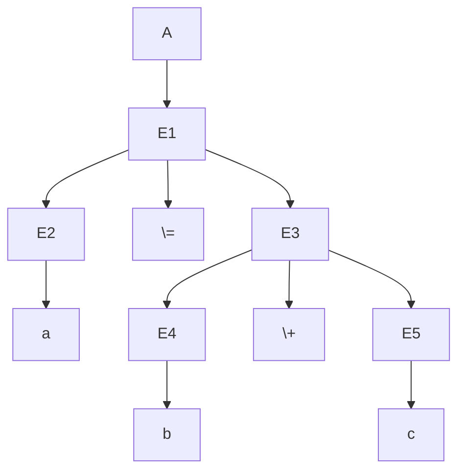

# Compiler Architecture

After we have studied CFG, we put it into the use of the compiler. All programming languages are CFG. And most programming languages are designed to be $LR(1)$ or $SLR(1)$.

We will illustrate how our previous knowledge can be applied.

## Tokenizer (Lexical Analyzer)

The first pipe is the tokenizer. The tokenizer converts the character stream into tokens. A token is an atomic word in the programming language, and it usually also carries a type.

For example,

```c
int a = b;
```

Can be parsed into,

```
(int, native_type)
(a, identifier)
(=, assign)
(b, identifier)
(;, semicolon)
```

The tokenizer does not consider the context of the tokens. It only converts the character stream into tokens based on certain rules. For example,

- `int, float` are native types.
- `=, +=, -=` are operators.
- `;` is the notation for the end of a line.
- Others are identifiers.

## Parser (Syntax Analyzer)

A parser converts token stream into an AST (abstract syntax tree). AST is just the parse tree of the CFG.

For example, let's consider a language that only has assign and plus. Defined as $A$.

$$
S \rightarrow A \\
A \rightarrow id = E \\
E \rightarrow E + E | id 
$$

This is an $LL(1)$ after eliminating left recursion (in more complex cases, we design $LR(1)$ or $SLR(1)$ grammar). So we can always parse any valid token stream into a parse tree.

For example, the parse tree for `a = b + c` is,



## Semantic Analysis

After we have an AST, we can do semantic analysis. Sometimes，maybe the parse tree is valid, yet the corresponding sentence may not be valid semantically. For example, in,

```c
a = b + c;
```

If `b` is integer and `c` is string, then this sentence is wrong semantically, not syntactically.

Sematic Analysis Checks the semantic validity of the parse tree. Usually, this is done at the same time with intermediate representation generation.

## Intermediate Representation Generation

Although, technically, we can directly translate AST into assembly. In most modern compilers, like LLVM, we first translate AST into a unified, platform independent intermediate representation, so that we can preform optimization in a platform independent way, so as not to reinvent the wheel.

For example,


This tree, we can parse it into,

```asm
add @mid, a, b
str c, @mid
```

Later we can convert this IR into assembly.

## Backend

The backend of an compiler consists of,

- Translating IR into assembly.
- Optimization.
- Linking.

We don't talk about the backend here.


