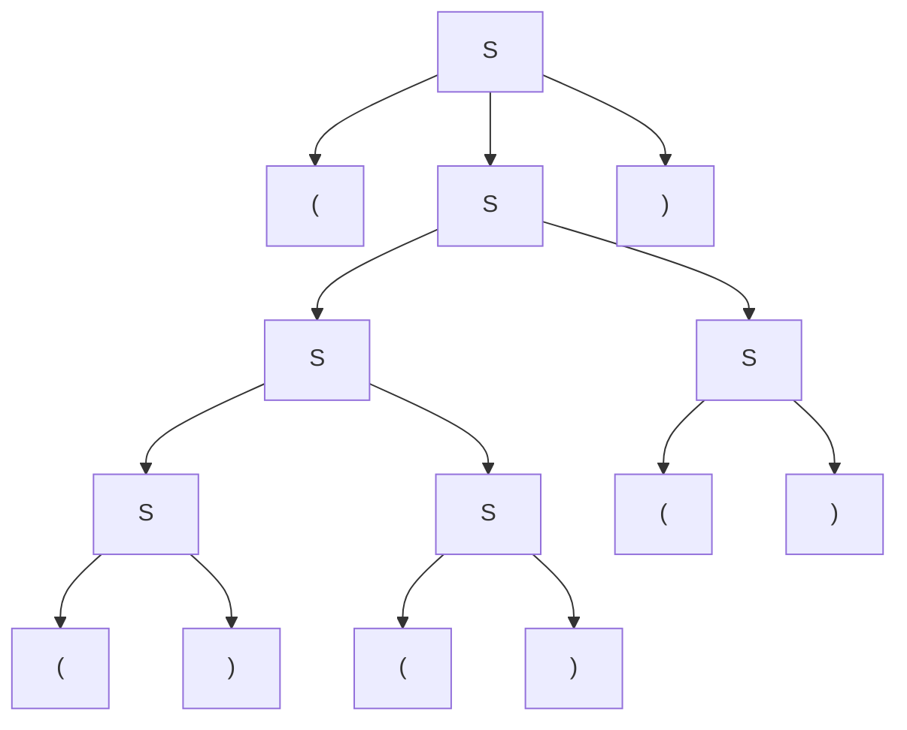
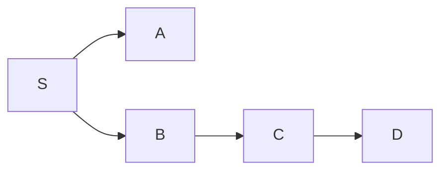
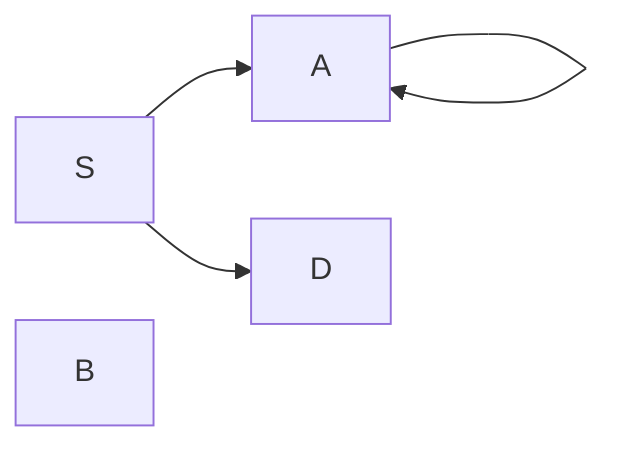

# Context Free Grammar

Context free grammar allows rules in the form of,

$$
A \rightarrow x
$$

Where $A \in \mathcal{N}$, $x \in (\mathcal{V} + \mathcal{N})^*$.

## Leftmost and Rightmost Derivations

Because a derivation operation allows us to replace any substring that is applicable to a rule, which results in uncertainty, we must have a deterministic way to derivate a sentence.

The leftmost derivation $\Rightarrow_{lm}$ force us to replace the leftmost non-terminal symbol in the sentence. The rightmost derivation $\Rightarrow_{rm}$ force us to replace the rightmost non-terminal symbol in the sentence.

Because we only change the order of the derivation, if only leftmost derivation or only rightmost derivation is allowed, the grammar generates the same language as the original grammar without restriction.

For example,

$$
S \rightarrow (S) | SS | ()
$$

Is a context free grammar that can generate paired parentheses.

Let's consider the sequence,

$$
(()()())
$$

There are many ways to generate this sequence, for example,

$$
S \Rightarrow (S) \Rightarrow (SS) \Rightarrow (S()) \Rightarrow (SS()) \Rightarrow (()S()) \Rightarrow (()()())
$$

We didn't choose the non-terminal to replace on the leftmost side nor the rightmost side. Thus, it is neither leftmost nor rightmost derivation.

But the following sequence,

$$
S \Rightarrow_{lm} (S) \Rightarrow_{lm} (SS) \Rightarrow_{lm} (()S) \Rightarrow_{lm} (()SS) \Rightarrow_{lm} (()()S) \Rightarrow_{lm} (()()())
$$

Is a leftmost derivation sequence.

Of course, the leftmost derivation sequence isn't always unique, consider,

$$
S \Rightarrow_{lm} (S) \Rightarrow_{lm} (SS) \Rightarrow_{lm} (SSS) \Rightarrow_{lm} (()SS) \Rightarrow_{lm} (()()S) \Rightarrow_{lm} (()()())
$$

However, since leftmost or rightmost derivation doesn't change the yielded language, we usually choose one so that it makes the analysis easier.

## Parse Tree

Parse tree is another way to represent the derivation of a sentence. We can use parse tree to prove that leftmost and rightmost derivation has the same result as the original derivation.

The root of a parse tree is always the starting symbol.

The leaves of a parse tree is always the terminal symbols.

The internal nodes of a parse tree is always the non-terminal symbols.

If a non-terminal generates sequence $v$, then each letter in $v$ is a child of the non-terminal node (in oreder).

For,

$$
S \Rightarrow_{lm} (S) \Rightarrow_{lm} (SS) \Rightarrow_{lm} (SSS) \Rightarrow_{lm} (()SS) \Rightarrow_{lm} (()()S) \Rightarrow_{lm} (()()())
$$

We have the following parse tree,

Because the we can traverse through the tree with DFS in any order (left first or right first), so the leftmost and rightmost derivation has the same result, so is for derivation without restriction.

## Ambiguity

If a sentence can be generated in more than one way using leftmost or rightmost derivation, then the grammar is ambiguous.

For sequence $(()()())$, we listed two different leftmost derivation,

$$
S \Rightarrow_{lm} (S) \Rightarrow_{lm} (SS) \Rightarrow_{lm} (()S) \Rightarrow_{lm} (()SS) \Rightarrow_{lm} (()()S) \Rightarrow_{lm} (()()())
$$

$$
S \Rightarrow_{lm} (S) \Rightarrow_{lm} (SS) \Rightarrow_{lm} (SSS) \Rightarrow_{lm} (()SS) \Rightarrow_{lm} (()()S) \Rightarrow_{lm} (()()())
$$

Thus, the grammar,

$$
S \rightarrow (S) | SS | ()
$$

Is ambiguous.

:::note

Ambiguous grammar can be defined in any of the following ways,

- Existing a sequence that has more than one ways to derive with leftmost or rightmost derivation.
- Existing a sequence that can be generated by more than one parse tree.

:::

Please note that ambiguous grammar doesn't mean ambiguous language. The same language can be generated with an unambiguous grammar,

$$
S → ( S ) S | \epsilon
$$

This is an unambiguous grammar.

:::tip

After the next chapter, you will see that this is actually an $LL(1)$ grammar that generates valid parentheses.

:::

However, things aren't always so nice- some languages has it's inherent ambiguity. That all grammar yields it is ambiguous. For example,

$$
0^i1^j2^k \; s.t. \; i = j \lor j = k
$$

Is an inherently ambiguous language.

## Chomsky Normal Form

### CNF and Nullable CNF

The context free grammar has too little restriction, that it is hard to study. Instead, we use an equal form called Chomsky Normal Form (CNF).

CNF grammar enforce rules to be in either of

$$
A \rightarrow BC \\
A \rightarrow a
$$

For CFG $\mathcal{G}$, there always exist an CNF $\mathcal{G}_{nf}$ that,

$$
\mathcal{L}(\mathcal{G}) - \{ \lambda \} = \mathcal{L}(\mathcal{G}_{nf})
$$

We can also use nullable CNF, that is, we specifically allow,

$$
S \rightarrow \lambda
$$

And enforce no other rule has $S$ as the target. Then,

$$
\mathcal{L}(\mathcal{G}) = \mathcal{L}(\mathcal{G}_{nf\;\text{nullable}})
$$

### Reduction into Chomsky Normal Form

To convert a CFG to CNF, we follow the given steps. The following step is logically valid and can be proven to have the listed properties on the generated language, but proving them is too trivial and grinding- so this note only shows you how to do it.

The reduction will yield a CNF that generates the same language but may be without the $\lambda$.

Please notice that the following steps must be done in order. Or else some non-CNF rules may exist after the steps.

#### Removing Empty Production

We find all,

$$
A_i \rightarrow \lambda
$$

Then we remove all of them.

#### Removing Unit Production

A unit production is a rule of the form,

$$
A \rightarrow B
$$

That a non-terminal only generates a new non-terminal.

If,

$$
A \rightarrow B \\
B \rightarrow b
$$

We abridge $A \rightarrow B$ to,

$$
A \rightarrow b
$$

This should be done recursively, until there is no more unit production.

#### Removing Dead Non-Terminal

Some non-terminal may never yield a terminal character. For example,

$$
B \rightarrow bB
$$

And there are no rule,

$$
B \rightarrow b'
$$

Then $B$ is a dead non-terminal. We should just remove all rules that yields string that contains $B$.

#### Removing Unreachable Non-Terminal

After our previous steps, some non-terminals may become out of reach from the start symbol. We simply remove them and any rules that contains them.

#### Decomposing Non-Terminal

For every rule that generates more than two symbols, for example,

$$
A \rightarrow aw
$$

Where $a$ can either be terminal or non-terminal, $w \in (\mathcal{N} + \mathcal{V})^+$.

We decompose it to,

$$
A \rightarrow A_1A_2 \\
A_1 \rightarrow a \\
A_2 \rightarrow w
$$

We repeat this process until the grammar is a CNF grammar.

### Example

That was a hell lot of things to memorize. Let's look at an example,

$$
S \rightarrow A | B \\
A \rightarrow aA | a | \lambda \\
B \rightarrow C | b \\
C \rightarrow D \\
D \rightarrow dDE | dD \\
E \rightarrow eE \\
$$

#### Removing Empty Production

The only empty production is,

$$
A \rightarrow \lambda
$$

We simply remove it, so that,

$$
S \rightarrow A | B \\
A \rightarrow aA | a \\
B \rightarrow C | b \\
C \rightarrow D \\
D \rightarrow dDE | dD \\
E \rightarrow eE \\
$$

#### Removing Unit Production

The unit production here includes,

$$
S \rightarrow A | B \\
B \rightarrow C \\
C \rightarrow D \\
$$

We can draw a tree based on the generated-by relation,

After abbreviating $C,D$,

$$
S \rightarrow A | B \\
A \rightarrow aA | a \\
B \rightarrow C | b \\
C \rightarrow dDE | dD \\
D \rightarrow dDE | dD \\
E \rightarrow eE \\
$$

Then $B,C$,

$$
S \rightarrow A | B \\
A \rightarrow aA | a \\
B \rightarrow dDE | dD | b \\
C \rightarrow dDE | dD \\
D \rightarrow dDE | dD \\
E \rightarrow eE \\
$$

Then $S,B$,

$$
S \rightarrow A | dDE | dD | b \\
A \rightarrow aA | a \\
B \rightarrow dDE | dD | b \\
C \rightarrow dDE | dD \\
D \rightarrow dDE | dD \\
E \rightarrow eE \\
$$

Then $S,A$,

$$
S \rightarrow aA | a | dDE | dD | b \\
A \rightarrow aA | a \\
B \rightarrow dDE | dD | b \\
C \rightarrow dDE | dD \\
D \rightarrow dDE | dD \\
E \rightarrow eE \\
$$

#### Removing Dead Non-Terminal

Here, $D,E$ never yields a fully terminal string, so we remove all rules that contains $D,E$.

$$
S \rightarrow aA | a | dD | b \\
A \rightarrow aA | a \\
B \rightarrow b \\
$$

#### Removing Unreachable Non-Terminal

Now we draw a graph based on the generated-by relation of all non-terminals.

We can see there is no path from $S$ to $B$, so we remove $B$ and all the rules that contains it.

$$
S \rightarrow aA | a | dD | b \\
A \rightarrow aA | a \\
$$

#### Decomposing Non-Terminal

Now we look at all the rules that go against CNF, that is,

$$
S \rightarrow aA | dD \\
A \rightarrow aA \\
$$

We break it by adding intermediate non-terminals,

$$
S \rightarrow S_aA | S_dD \\
A \rightarrow A_aA \\
A_a \rightarrow a \\
S_a \rightarrow a \\
S_d \rightarrow d \\
$$

Now this is the CNF of the original grammar.

Later, our analysis will be basedon the CNF form of the CFG.
