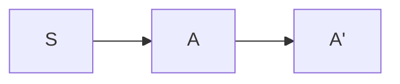

# LL(1) Grammar

Previously, we defined an unambiguous grammar under leftmost derivation as $LL(1)$, the left starting, leftmost derivation grammar with one look ahead. This part, we will focus on how we can test wether a CFG is $LL(1)$.

## Testing a CFG for $LL(1)$

### Eliminate Left Recursion

Left recursion refers to the rules in form of,

$$
A \rightarrow Aa
$$

Or there may exists indirect left recursion,

$$
A \rightarrow Bb \\
B \rightarrow Aa
$$

If $A \Rightarrow Ax$ can be inferred from the given rule set, the given rule set exists left recursion.

All CFG that has left recursion can't be $LL(1)$. However, we can eliminate left recursion by rewriting. That is,

#### Rewrite Left Recursion

$$
A \rightarrow A \alpha | \beta
$$

To eliminate the left recursion,

1.	Create a new non-terminal (let’s call it $A'$) to handle the recursive part.
2.	Reformulate the rules so that the recursive calls happen in the right-hand side and are postponed.

That is, making it, into:

$$
A \rightarrow \beta A’
$$

$$
A’ \rightarrow \alpha A’ | \lambda
$$

So that it is right recursion instead of left recursion.

#### Flatten Indirect Left Recursion

For indirect left recursion, we can flat them into direct left recursion. That is, for,

$$
E_i \rightarrow A_ix'_i | z_i \\
A_0 \rightarrow A_1x_1 | y_1 \\
A_1 \rightarrow A_2x_2 | y_2 \\
\ldots \\
A_{n} \rightarrow A_0x_0 | y_0
$$

We should flatten this by iteratively substitution. That is, we can replace,

$$
E_1 \rightarrow A_1x'_1 | z_1 \\
A_0 \rightarrow A_1x_1 | y_1 \\
A_1 \rightarrow A_2x_2 | y_2 \\
$$

With,

$$
A_0 \rightarrow A_2x_2x_1 | y_2y_1 | y_1 \\
E_1 \rightarrow A_2x_2x'_1 | y_2x'_1 | z_1 \\
$$

This can be done iteratively until,

$$
A_0 \rightarrow A_0 x_0 x_n \ldots x_1 | \ldots
$$

So that there is no indirect left recursion.

#### Example

$$
S \rightarrow A | C \\
A \rightarrow A b | C a | a \\
C \rightarrow A e | f
$$

We first flatten the indirect left recursion caused by,

$$
A \rightarrow Ca \\
C \rightarrow A e
$$

So, we can eliminate $C$,

$$
S \rightarrow A | Ae | f \\
A \rightarrow A b | A e a | f | a \\
$$

Now there is no indirect left recursion.

Then we eliminate left recursion,

$$
S \rightarrow A | Ae | f \\
A \rightarrow fA' | aA' | fA'' | aA'' \\
A' \rightarrow bA' | \lambda \\
A'' \rightarrow eA'' | \lambda \\
$$

This is the final grammar without left recursion.

### Factor Common Prefixes

Sometimes we may have,

$$
A \rightarrow xB | xC
$$

There are two targets with same prefix. We should factor them out. That is,

$$
A \rightarrow xA' \\
A' \rightarrow B | C
$$

This isn't present in our example.

### Calculate the FIRST Set of Every Non-Terminal

The FIRST set of a non-terminal is defined as,

$$
\text{FIRST}(A) = \{0@v | A \Rightarrow^* v \}
$$

If $A \Rightarrow^* \lambda$, then,

$$
\text{FIRST}(A) = \{0@v | A \Rightarrow^* v \} + \{\lambda\}
$$

We also define the FIRST set of a terminal as,

$$
\text{FIRST}(a) = \{a\}
$$

For a sentence $x$, the FIRST set is defined as,

$$
\text{FIRST}(x) = \text{FIRST}(0@x)
$$

That is, for $x$, $\text{FIRST}(x)$ contains the first character of every possible derivation of $x$. For null sentence, we treat the first character as $\lambda$.

Because we have eliminated left recursion, getting FIRST set is simple- we try every path of the derivation and, once we have a terminal symbol at the beginning, we add it to the set and end this path.

To be more specific, for each rule, if it's in form of,

$$
A \rightarrow aw
$$

So that $a$ should be added to the FIRST set of $A$.

Or,

$$
A \rightarrow Bw
$$

So then every symbol in $\text{FIRST}(B)$ should be added to the FIRST set of $A$.

Sometimes, we also have,

$$
A \rightarrow \lambda
$$

We will add $\lambda$ to the FIRST set of $A$.

Because there is no left recursion, the second case won't case any problem.

For example,

$$
S \rightarrow A | Ae | f \\
A \rightarrow fA' | aA' \\
A' \rightarrow bA' | \lambda
$$

This is a subset of our previous left recursion elimination example. Thus there is also no left recursion.

We usually draw a graph that denotes the generated-by relationship between non-terminals. If a non-terminal $A$ can be generated by $B$, we draw an edge from $B$ to $A$.

We ignore self-loops.

So,

Then we usually do this in the order of topological sort. So that if we need to use the FIRST set of a non-terminal to calculate the FIRST set of another, they must have already been calculated.

:::tip

The topological order of a set of nodes in a graph is a linear ordering of the nodes such that for every edge $u\rightarrow v$ in the graph, $u$ comes before $v$ in the ordering.

In practice, we take the first node that doesn't have any incoming edge as the start of the ordering. Then we remove this node and repeat the process until all nodes have been visited.

For acyclic graphs, we can always do thi.

:::

So we start with $A'$, because the only rules for $A'$ are,

$$
A' \rightarrow bA' | \lambda
$$

So $\text{FIRST}(A') = \{b, \lambda\}$.

Then the $A$. Obviously, we can have,

$$
\text{FIRST}(A) = \{f, a\}
$$

Lastly for $S$, because $S$ yields non-terminals $A$ at the left, or terminal $f$, so,

$$
\text{FIRST}(S) = \{f\} + \text{FIRST}(A) = \{f, a\}
$$

### Calculate the FOLLOW Set of Every Non-Terminal

The FOLLOW set of a non-terminal is defined as,

$$
\text{FOLLOW}(A) = \{ a | v \in \mathcal{I}, v = xAay\}
$$

Where $a$ is the terminal symbol that is after $A$. $x$ and $y$ are arbitrary symbols.

That is to say, the FOLLOW set of a non-terminal is all the possible terminal symbols that are after the non-terminal during the derivation.

Specially, we will always add $\sout{S}$ to the FOLLOW set of $S$. This is a special character denoting the end of the sentence. Because empty input is accepted, $S$ can always have $\sout{S}$ in the FOLLOW set.

To get the FOLLOW set, more practically, we check every rule.

If it's in form of,

$$
A \rightarrow zBax
$$

Then we add $a$ to the FOLLOW set of $B$ ($x, z$ is any intermediate sentence and $a$ is a terminal symbol).

If it's in form of,

$$
A \rightarrow zBCx
$$

Then we add all of $\text{FIRST}(C)$ to the FOLLOW set of $B$.

If it's in form of,

$$
A \rightarrow zB
$$

Then we add all of $\text{FOLLOW}(A)$ to the FOLLOW set of $B$.

If,

$$
A \rightarrow aA
$$

We ignore it because it doesn't contribute to the FOLLOW set of $A$.

Specially, we will always add $\sout{S}$ to the FOLLOW set of $S$.

We still use,

$$
S \rightarrow A | Ae | f \\
A \rightarrow fA' | aA' \\
A' \rightarrow bA' | \lambda
$$

And do it in reversed topological order.

Previously, we have FIRST sets,

$$
\text{FIRST}(S) = \{f, a\} \\
\text{FIRST}(A) = \{f, a\} \\
\text{FIRST}(A') = \{b, \lambda\}
$$

There are no rules generating $S$, and because $S$ is the start symbol, so, $\text{FOLLOW}(S)=\{\sout{S}\}$.

For $A$,

$$
S \rightarrow A \\
S \rightarrow Ae
$$

Thus, $\text{FOLLOW}(A) = \text{FOLLOW}(S) + \{e\} = \{e, \sout{S} \}$

For $A'$,

$$
A \rightarrow fA' | aA' \\
A' \rightarrow bA'
$$

Thus, $\text{FOLLOW}(A') = \text{FOLLOW}(A) = \{e, \sout{S} \}$.

#### Calculate the SELECT Set of Every Rule

The SELECT set of a rule $A \rightarrow x$ is defined as,

$$
\text{SELECT}(A \rightarrow x) = \begin{cases}
\text{FIRST}(x) \cup \text{FOLLOW}(A) & \text{if } \lambda \in \text{FIRST}(x) \\
\text{FIRST}(x) & \text{if } \lambda \not\in \text{FIRST}(x)
\end{cases}
$$

$\text{SELECT}(A \rightarrow x)$ is all the possible terminal symbols that can exist in a final sentence that can be generated from the rule.

Previously, we had,

$$
\text{FIRST}(S) = \{f, a\} \\
\text{FOLLOW}(S) = \{\sout{S}\} \\
\text{FIRST}(A) = \{f, a\} \\
\text{FOLLOW}(A) = \{e, \sout{S}\} \\
\text{FIRST}(A') = \{b, \lambda\} \\
\text{FOLLOW}(A') = \{e, \sout{S}\}
$$

And rules,

$$
S \rightarrow A | Ae | f \\
A \rightarrow fA' | aA' \\
A' \rightarrow bA' | \lambda
$$

So,

$$
\text{SELECT}(S \rightarrow A) = \text{FIRST}(A) = \{f, a\} \\
\text{SELECT}(S \rightarrow Ae) = \text{FIRST}(A) = \{f, a\} \\
\text{SELECT}(A \rightarrow fA') = \text{FIRST}(fA') = \{f\} \\
\text{SELECT}(A \rightarrow aA') = \text{FIRST}(aA') = \{a\} \\
\text{SELECT}(A' \rightarrow bA') = \text{FIRST}(bA') + \text{FOLLOW}(A') = \{b, e, \sout{S}\}
$$

#### Test for $LL(1)$

For every rule in form of,

$$
A \rightarrow x_0 | x_1 | \ldots | x_n
$$

If

$$
\text{SELECT}(A\rightarrow x_0) \cap \text{SELECT}(A\rightarrow x_1) \cap \ldots \cap \text{SELECT}(A\rightarrow x_n) \neq \emptyset
$$

Then the grammar is not $LL(1)$.

In this example,

$$
\text{SELECT}(S \rightarrow A) = \text{FIRST}(A) = \{f, a\} \\
\text{SELECT}(S \rightarrow Ae) = \text{FIRST}(A) = \{f, a \} \\
\text{SELECT}(A \rightarrow fA') = \text{FIRST}(fA') = \{f\} \\
\text{SELECT}(A \rightarrow aA') = \text{FIRST}(aA') = \{a\} \\
\text{SELECT}(A' \rightarrow bA') = \text{FIRST}(bA') + \text{FOLLOW}(A') = \{b, e, \sout{S}\}
$$

$S \rightarrow A$ and $S \rightarrow Ae$ generates overlapping SELECT sets, so the grammar is not $LL(1)$.

## Constructing LL Table

Now we need to create a table based on the FIRST and FOLLOW sets. This will come into handy when we introduce PDA in the next section.

The table has row indices of every non-terminal, and column indices of every terminals. We note this table as, $\mathrm{LLTb}(A, a)$.

- For every $A \rightarrow x$, if $\exist a \in FIRST(x)$, such that $a = 0 @ x$ or $a \in \text{FIRST}(0 @ x)$, then we add $A \rightarrow x$ to the table cell $\mathrm{LLTb}(A, a)$.
- For every $A \rightarrow x$, if $x = \lambda$ or $\lambda \in \text{FIRST}(x)$, for each $b \in \text{FOLLOW}(A)$, we add $A \rightarrow x$ to the table cell $\mathrm{LLTb}(b, a)$.

Let's consider rules,

$$
S \rightarrow A | d \\
A \rightarrow fA' \\
A' \rightarrow bA' | \lambda
$$

| Non-terminal | FIRST       |
|----------|----------------|
| $S$        | $\{d, f\} $        |
| $A$        | $\{f\}$            |
| $A'$       | $\{b, \lambda\}$  |

| Non-terminal | FOLLOW      |
|----------|----------------|
| $S$    | $\{\sout{S}\}$  |
| $A$       | $\{\sout{S}\}$ |
| $A'$    | $\{\sout{S}\}$    |

If you calculate the SELECT, you can find out that it is $LL(1)$.

Based on the given rules, we create the LL table,

For $S \rightarrow d$, $d \in \text{FIRST}(d)$, so we add $S \rightarrow d$ to the table cell $\mathrm{LLTb}(S, d)$.

For $S \rightarrow A$, $f \in \text{FIRST}(A)$, so we add $S \rightarrow A$ to the table cell $\mathrm{LLTb}(S, f)$.

For $A \rightarrow fA'$, $f \in \text{FIRST}(fA')$, so we add $A \rightarrow fA'$ to the table cell $\mathrm{LLTb}(A, f)$.

For $A' \rightarrow bA'$, $b \in \text{FIRST}(bA')$, so we add $A' \rightarrow bA'$ to the table cell $\mathrm{LLTb}(A', b)$.

Because $A' \rightarrow \lambda$ generates $\lambda$, we should add  $A' \rightarrow \lambda$ to all $\mathrm{LLTb}(A', c) \quad \forall c \in \text{FOLLOW}(A')$.

That is, we have the following LL table,

|     | $b$ | $d$ | $f$ | $\sout{S}$ |
|-----|-----|-----|-----|-------------|
| $S$ | | $S\rightarrow d$ | $S\rightarrow A$ | |
| $A$ | | | $A\rightarrow fA'$ | |
| $A'$| $A'\rightarrow bA'$ | | | $A'\rightarrow \lambda$ |

:::tip

If there exists a cell that has more than one rule, then the grammar is not $LL(1)$. If you met this, you should check if you got the correct FIRST, FOLLOW sets, and correctly tested it.

:::

LL table tells us, if we want a sequence $x$, how we should derive it.

1. We append $\sout{S}$ to $x$, then, we have a pointer at $0$, call it $i$. Now we have the intermediate sentence $m$. Initially, $m = S$.
2. We check the table cell, $\mathrm{LLTb}(\text{Leftmost}(m), i@x)$. We use the rule in this cell to perform leftmost derivation on the current intermediate sentence. If there exists no rule in the cell, it means that the given sequence cannot be derived from the grammar. If there exists no more non-terminals, the derivation is complete.
3. Let $i + k$ be the new pointer, then repeat 2. $k$ is the length of the newly generated terminals on the left side.

We collect every derivation in the step $2$. This is how we can use LL table to derive a sequence with leftmost derivation.

For our table,

|     | $b$ | $d$ | $f$ | $\sout{S}$ |
|-----|-----|-----|-----|-------------|
| $S$ | | $S\rightarrow d$ | $S\rightarrow A$ | |
| $A$ | | | $A\rightarrow fA'$ | |
| $A'$| $A'\rightarrow bA'$ | | | $A'\rightarrow \lambda$ |

Let's consider sequence $x = fbb$.

1. We make $x = fbb\sout{S}$. Let pointer $i = 0$. Our initial sentence is $S$.
2. We check the cell $\mathrm{LLTb}(S, f)$. It tells to derive $S \Rightarrow A$.
3. $i = 0$
4. We check $\mathrm{LLTb}(A, f)$. It tells to derive $A \Rightarrow fA'$.
5. $i = 1$
6. We check $\mathrm{LLTb}(A', b)$. It tells to derive $fA' \Rightarrow fbA'$.
7. $i = 2$
8. We check $\mathrm{LLTb}(A', b)$. It tells to derive $fbA' \Rightarrow fbbA'$.
9. $i = 3$
10. We check $\mathrm{LLTb}(A', \sout{S})$. It tells to derive $A' \Rightarrow \lambda$.

So the leftmost derivation to get $fbb$ is,

$$
S \Rightarrow_{lm} A \Rightarrow_{lm} fA' \Rightarrow_{lm} fbA' \Rightarrow_{lm} fbb
$$
