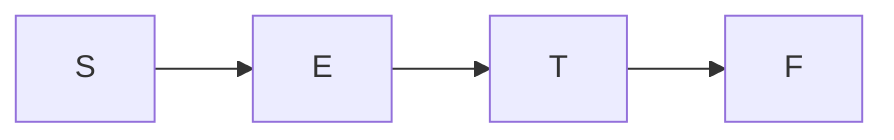

# LR Grammar

$LL(1)$ language has good enough properties for us to write a simple parser. However, $LL(1)$ still has too many restrictions and sometimes not expressive enough. An alternative approach would be to use $LR(1)$ grammar, which is left starting, rightmost derivation and look ahead of one symbol. Using $LR(1)$, for any given sequence, we can derivate a leftmost reduction path, thus constructing a parse tree using rightmost derivation.

However, $LR(1)$ is too complex sometimes, we may also use $SLR(1)$, simplified version of $LR(1)$, or $LALR(1)$, which is a combination of $LR(1)$ and $SLR(1)$. We also introduce $LR(0)$.

## OPG Parser

OPG Parser is a simplified, and in a sense, reversed PDA that has only one state. All CFG can be accepted by a single-node PDA.

:::info

In the last section, when converting from CFG to PDA, we constructed a single node PDA that can accept all CFG.

:::

:::tip

When constructing PDA from CFG, we see that one-state PDA has the same expressive power as multiple-states. This is true with empty-stack-equals-acceptance. For accept state set, we need two states, one for the starting, one for the end, so that we can have the same expressive power.

Two states with accept state set basically have an extra rule that when the stack is empty, go to the accept state.

:::

OPG parser is based on deduction. It has four possible actions,

- Move to the next input symbol, and put it into its stack.
- Pop a few elements from the stack, deduce it into a single non-terminal, then put the non-terminal into the stack.
- If there only left start symbol in the stack and the inputs are exhausted, accept.
- The inputs have exhausted but there are more signs in the stack other than the start symbol, and the machine can not do any more deduction, reject.

This basically is a PDA that walks backward from the end. But in another sense, similar to what we learnt back in the left linear grammar, this walking-backward can be converted into a normal PDA by tweaking the rules.

Nonetheless, we will not focus on how LR parser works as a PDA. It's not the focus.

Now, we have only one issue- how can we define which action the parser should take? Accept and reject are easy to judge, but when should a deduction or a move happen?

## Operator Precedence Grammar

OPG is a grammar that, besides what common grammar possesses, it also has a relation, that for any two terminals, $a, b \in \mathcal{V}$, one of, $a \equiv b$, $a \not < b$, or $a \not < b$ exists.

:::tip

Our notion **DOES NOT IMPLY PARTIAL ORDER**. That is, 

$$
a \not > b
$$

**DOES NOT IMPLY** $a \not < b$.

$a \equiv a$ is also **NOT ALWAYS TRUE**.

:::

We define the order as, (for grammar that doesn't produce $\lambda$),

- $a \equiv b$ if and only if there exists rules like $A \rightarrow \ldots ab \ldots$ or $A \rightarrow \ldots aBb \ldots$.
- $a \not < b$ if and only if there exists $A \rightarrow \ldots aB \ldots$ and $B \Rightarrow^+ b \ldots$ or $B \Rightarrow^+ bC \ldots$.
- $a \not > b$ if and only if there exists $A \rightarrow \ldots Bb \ldots$ and $B \Rightarrow^+ \ldots a$ or $B \Rightarrow^+ \ldots aC$.

:::tip

A bit hard to understand. This order is actually the order of reduction. If we have,

$$
S \rightarrow Bb \\
B \rightarrow aC \\
C \rightarrow c
$$

For any deduction, the $a$ is guaranteed to disappear into non-terminals after $b$ does, so that $a \not > b$.

For example, consider deducting the string $acb$,

$$
acb \Leftarrow aCb \\
\Leftarrow Bb \\
\Leftarrow S
$$

$a$ always disappear before $b$.

:::

If $a$ and $b$ is never adjacent (ignoring the non-terminals) in any rules, we can assign arbitrary order to them.

If you can define two relations on one pair, then it means that the grammar isn't OPC, you should consider refactoring.

For example, consider the following grammar that yields mathematical expression with only multiplication and addition,

$$
S \rightarrow E \\
E \rightarrow E + E \\
E \rightarrow E * E \\
E \rightarrow (E) \\
E \rightarrow 0 | 1 | 2 | 3 | 4 | 5 | 6 | 7 | 8 | 9
$$

Because of,

$$
E \rightarrow E + E \\
E \rightarrow E * E \\
$$

So $+ \not > *$ and $+ \not < *$ is valid at the both time, so, it's not OPC.

However, we can rewrite it into,

$$
S \rightarrow E \\
E \rightarrow E + T | T \\
T \rightarrow T * F | F \\
F \rightarrow (E) | 0 | 1 | 2 | 3 | 4 | 5 | 6 | 7 | 8 | 9
$$

Here, $+$ is always reduced after $*$, and thus $* \not > +$ is valid. Thus, it is an OPC.

### Construct Precedence Table

#### FIRSTOP and LASTOP

We can't iterate through every rule to get the precedence. Here is a systematic algorithm.

Define the $\text{FIRSTOP}$ and $\text{LASTOP}$ of a non-terminal $A$. The first being all possible terminals that can be the first terminals of all the sentences derivate from $A$, and the latter is the last. To formulate it formally,

$$
\text{FIRSTOP}(A) = \{b | A \Rightarrow^+ b \ldots \lor A \Rightarrow^+ Bb \ldots \quad B \in \mathcal{N}, b \in \mathcal{V} \} \\
\text{LASTOP}(A) = \{b | A \Rightarrow^+ \ldots b \lor A \Rightarrow^+ \ldots Cb  \quad B \in \mathcal{N}, b \in \mathcal{V}\}
$$

Then, for,

$$
A \rightarrow \ldots ab \ldots
$$

There must be $a \equiv b$.

For,

$$
A \rightarrow \ldots aB \ldots
$$

$\forall b \in \text{FIRSTOP}(B), a \not < b$.

For,

$$
A \rightarrow \ldots Ba \ldots
$$

$\forall b \in \text{LASTOP}(B), a \not > b$.

Now the problem is how to obtain $\text{FIRSTOP}$ and $\text{LASTOP}$.

Because we have,

If,

$$
A \rightarrow B \ldots
$$

Then, $\text{FIRSTOP}(B) \subset \text{FIRSTOP}(A)$.

If,

$$
A \rightarrow \ldots B
$$

Then, $\text{LASTOP}(B) \subset \text{LASTOP}(A)$.

That tells us that we should construct $\text{FIRSTOP}$ and $\text{LASTOP}$ in topological order.

For the grammar,

$$
S \rightarrow E \\
E \rightarrow E + T | T \\
T \rightarrow T * F | F \\
F \rightarrow (E) | 0 | 1 | 2 | 3 | 4 | 5 | 6 | 7 | 8 | 9
$$

We shorten it into,

$$
S \rightarrow E \\
E \rightarrow E + T | T \\
T \rightarrow T * F | F \\
F \rightarrow (E) | n
$$

And treat $n$ as a terminal for convenience.

We draw a graph based on first-generate relationship. That is,

In the topological order, we first need $\text{FIRSTOP}$.

$$
\text{FIRSTOP}(F) = \{n, (\}
$$

And we walk up the graph, because there is the first terminals generated by $T$ is only $*$, and $T \rightarrow F$,

$$
\text{FIRSTOP}(T) = \text{FIRSTOP}(F) + \{*\} = \{n, (, *\}
$$

And,

$$
\text{FIRSTOP}(E) = \text{FIRSTOP}(T) + \{+\} = \{n, (, *, +\}
$$

$$
\text{FIRSTOP}(S) = \text{FIRSTOP}(E) = \{n, (, *, +\}
$$

Now, draw another graph based on last-generate relationship, which, here, happens to be exactly identical to the $\text{FIRSTOP}$ graph,

And,

$$
\text{LASTOP}(F) = \{n, )\} \\
\text{LASTOP}(T) = \{*, n, )\} \\
\text{LASTOP}(E) = \{+, *, n, )\} \\
\text{LASTOP}(S) = \{+, *, n, )\}
$$

And we are done.

#### Determining Precedence

Because our deduction concerns the end-of-text symbol $\sout{S}$, we add an extra rule,

$$
S' \rightarrow \sout{S}S\sout{S}
$$

The use $S'$ as the starting symbol, so that the precedence of $\sout{S}$ will come out naturally.

Now, for rule,

$$
A \rightarrow X_0 X_1 \ldots X_{n - 1}
$$

Where $X_i \in \mathcal{N} \cup \mathcal{V}$

- If $X_iX_{i+1} \in \mathcal{V}\mathcal{V}$, then $X_i \equiv X_{i+1}$.
- If $X_iX_{i+1}X_{i+2} \in \mathcal{V}\mathcal{N}\mathcal{V}$, then $X_i \equiv X_{i+2}$.
- If $X_iX_{i+1} \in \mathcal{V}\mathcal{N}$, then $\forall b \in \text{FIRSTOP}(X_{i+1}), X_i \not < b$.
- If $X_iX_{i+1} \in \mathcal{N}\mathcal{V}$, then $\forall b \in \text{LASTOP}(X_{i}), b \not > X_{i+1}$.

For convenience, we note,

$$
b \not > S
$$

Where $S$ is a set as a shorthand for,

$$
\forall a \in S, b \not > a
$$

And this shorthand is also used for $\not <$ and $\equiv$.

We had,

$$
\text{FIRSTOP}(F) = \{n, (\} \\
\text{FIRSTOP}(T) = \{*, n, (\} \\
\text{FIRSTOP}(E) = \{+, *, n, (\} \\
\text{FIRSTOP}(S) = \{+, *, n, (\} \\
\text{LASTOP}(F) = \{n, )\} \\
\text{LASTOP}(T) = \{*, n, )\} \\
\text{LASTOP}(E) = \{+, *, n, )\} \\
\text{LASTOP}(S) = \{+, *, n, )\} \\
$$

And rules,

$$
S' \rightarrow \sout{S}S\sout{S} \\
S \rightarrow E \\
E \rightarrow E + T | T \\
T \rightarrow T * F | F \\
F \rightarrow (E) | n
$$

Unit productions like $S \rightarrow E$, $E \rightarrow T$, and $T \rightarrow F$ doesn't yield any precedence information.

$S' \rightarrow \sout{S}S\sout{S}$ tells us that, $\sout{S} \not < \text{FIRSTOP}(S)$, $ \text{LASTOP}(S) \not > \sout{S}$, and $\sout{S} \equiv \sout{S}$.

$E \rightarrow E + T$ tells us that, $\text{LASTOP}(E) \not > +$, $+ \not < \text{FIRSTOP}(T)$.

$T \rightarrow T * F$ tells us that, $\text{LASTOP}(T) \not > *$, $* \not < \text{FIRSTOP}(F)$.

$F \rightarrow (E)$ tells us that, $( \equiv )$, $( \not < \text{FIRSTOP}(E)$ and $\text{LASTOP}(E) \not > )$.

Make them into a table,

|     |     $+$ |    $*$ |    $($ |   $)$ |    $n$ | $\sout{S}$ |
|-----|---------|--------|--------|-------|--------|-----------|
| $+$ |$\not >$|$\not <$|$\not <$|$\not >$|$\not <$|$\not >$   |
| $*$ |$\not >$|$\not >$|$\not <$|$\not >$|$\not <$|$\not >$   |
| $($ |$\not <$|$\not <$|$\not <$|$\equiv$|$\not <$|$\not >$   |
| $)$ |$\not >$|$\not >$|   -    |$\not >$|  -     | -        |
| $n$ |$\not >$|$\not >$|   -    |$\not >$|  -     |$\not >$  |
|$\sout{S}$|$\not <$|$\not <$|-|$\not <$|$\not <$|$\equiv$|

$-$ denotes there doesn't exist a precedence relation.

### Parser

The parser of OPG is a monotonically increasing stack machine. If the newly pushed symbol violates the precedence relation, we perform a deduction.

We had,

$$
S' \rightarrow \sout{S}S\sout{S} \\
S \rightarrow E \\
E \rightarrow E + T | T \\
T \rightarrow T * F | F \\
F \rightarrow (E) | n
$$

|     |     $+$ |    $*$ |    $($ |   $)$ |    $n$ | $\sout{S}$ |
|-----|---------|--------|--------|-------|--------|-----------|
| $+$ |$\not >$|$\not <$|$\not <$|$\not >$|$\not <$|$\not >$   |
| $*$ |$\not >$|$\not >$|$\not <$|$\not >$|$\not <$|$\not >$   |
| $($ |$\not <$|$\not <$|$\not <$|$\equiv$|$\not <$|$\not >$   |
| $)$ |$\not >$|$\not >$|   -    |$\not >$|  -     | -        |
| $n$ |$\not >$|$\not >$|   -    |$\not >$|  -     |$\not >$  |
|$\sout{S}$|$\not <$|$\not <$|-|$\not <$|$\not <$|$\equiv$|

An OPG parser works in the following way, conside the next symbol $s$,

- If the current stack looks like $x_i (\not < \text{or} \equiv) x_{i+1} (\not < \text{or} \equiv)  \cdots (\not < \text{or} \equiv) x_k (\not < \text{or} \equiv) s$, then we push $s$ into the stack. Please note that $x_i$ are the terminals in the stack. We ignore the non-terminals.
- If the current stack looks like $x_i \not < x_{i+1} (\not < \text{or} \equiv) \cdots (\not < \text{or} \equiv) x_k \not > s$, then we perform a deduction by finding the leftmost $x_i$ such that $x_ix_{i+1}\ldots x_k$ match the source of a rule, and then deduce it into a single non-terminal. This should be done recursively until there exists no such $x_i$. Then we can push the $s$ into the stack.

Let's see how the machine would parse $n + n * n$.

Firstly, it adds special symbols, $\sout{S}n+n*n\sout{S}$. For convenience, we note the input sequence as $s_0s_1\ldots s_i \downarrow s_{i+1} \ldots s_n$. The part before the $\downarrow$ is the part that the parser has taken in, and the part after is the remaining part. The next symbol to handle will be $s_{i+1}$.

|          Input Sequence           | Stack SnapShot | Action |     Reduction     |          Reason          |
|-----------------------------------|----------------|--------|-------------------|--------------------------|
|$\downarrow \sout{S}n+n*n\sout{S}$ |                | Shift  |                   |Empty Stack |
|$\ldots \downarrow n+n*n\sout{S}$ | $\sout{S}$     | Shift  |                   |$\sout{S}\not < n$        |
|$\ldots \downarrow +n*n\sout{S}$ | $\sout{S}n$    | Reduce |$n+n*n \Leftarrow F+n*n$|$\sout{S} \not < n\not > +$|
|$\ldots \downarrow +n*n\sout{S}$|$\sout{S}F$ | Reduce |$F+n*n\Leftarrow T+n*n$| - |
|$\ldots \downarrow +n*n\sout{S}$|$\sout{S}T$ | Reduce |$T+n*n\Leftarrow E+n*n$| - |
|$\ldots \downarrow +n*n\sout{S}$|$\sout{S}E$ | Shift  |                   |$\sout{S} \not < +$|
|$\ldots \downarrow n*n\sout{S}$|$\sout{S}E+$ | Shift | |$\sout{S}\not < + \not < n$|
|$\ldots \downarrow *n\sout{S}$|$\sout{S}E+n$ | Reduce |$E+n*n\Leftarrow E+F*n$|$\sout{S}\not < + \not < n \not > *$|
|$\ldots \downarrow *n\sout{S}$|$\sout{S}E+F$ | Reduce |$E+F*n\Leftarrow E+T*n$| - |
|$\ldots \downarrow *n\sout{S}$|$\sout{S}E+T$ | Shift | |$\sout{S}\not < + \not < *$|
|$\ldots \downarrow n\sout{S}$|$\sout{S}E+T*$ | Shift | |$\sout{S}\not < + \not < * \not < n$|
|$\ldots \downarrow \sout{S}$|$\sout{S}E+T*n$ | Reduce |$E+F*n\Leftarrow E+T*F$|$\sout{S}\not < + \not < * \not < n \not > \sout{S}$|
|$\ldots \downarrow \sout{S}$|$\sout{S}E+T*F$ | Reduce |$E+T*F \Leftarrow E+T$|$\sout{S}\not < + \not < * \not > \sout{S}$|
|$\ldots \downarrow \sout{S}$|$\sout{S}E+T$ | Reduce |$E+T \Leftarrow E$|$\sout{S}\not < + \not > \sout{S}$|
|$\ldots \downarrow \sout{S}$|$\sout{S}E$ | Reduce |$E \Leftarrow S$| - |
|$\ldots \downarrow \sout{S}$|$\sout{S}S$ | Shift | | $\sout{S} \equiv \sout{S}$ |
|$\lambda$|$\sout{S}S\sout{S}$ | | | | | - |

So we have the reduction sequence.

However, in some rows, we gave the reason $-$. This is because, in those rows, there exists conflicts. That is, at such states, whether,

- You can either shift or continue reduction. This is called the shift-reduce conflict.
- There are multiple source that you can reduce into. This is called the reduce-reduce conflict.

In the table above, we resolved that by choosing the option that the input can be parsed- we can do it in simple cases, but machines can't do so.

This issue is caused by the nature of PDA- PDA is a e-NFA with a stack. In our discussion above, to reduce means to walk back in the PDA. However, because e-NFA is non-deterministic, thus allowing multiple transitions- and multiple transition means conflicts, which, in theory, is not a big deal, yet in practice, will cause the rise of time complexity.

We will later see that by replacing the e-NFA with a DFA, that is, a DFA with a stack, we can solve this issue elegantly- albeit it imposes more restrictions on the grammar.

In practice, we need to do backtrace to find the only possible reduction sequence encountered with such conflicts. However, more commonly, we design the grammar so that there exists easier ways to decide the action in conflicts.

## Look Ahead LR

The basic idea of $LR(k)$ is to look ahead $k$ characters so that we can decide on the action. Just like what we did with $LL(1)$, where, by looking a head of one character, we can decide how to derivate the sentence (If the grammar is $LL(1)$).

The parser or LR is identical to OPG, except that it has it's own rules to resolve conflict, unlike OPG, which requires back tracing.

Let's consider the following grammar,

$$
S \rightarrow E \\
E \rightarrow E + E \\
E \rightarrow n \\
$$

And let's perform leftmost reduction (rightmost derivation) for $n + n$.

$$
n + n \Leftarrow E + n \Leftarrow E + E \Leftarrow E \Leftarrow S
$$

Our ideal parser should mimic this behavior,

| Stack Snapshot | Input | Action |
|---------------|-------|--|
|$\sout{S}$ | $\sout{S} \downarrow n + n \sout{S}$ |Shift |
|$\sout{S}n$ | $\sout{S}n\downarrow + n \sout{S}$ |Reduce|
|$\sout{S}E$ | $\sout{S}n\downarrow + n \sout{S}$ | Shift |
|$\sout{S}E+$ | $\sout{S}n+\downarrow n \sout{S}$ | Shift |
|$\sout{S}E+n$|$\sout{S}n+n\downarrow \sout{S}$ | Shift |
|$\sout{S}E+E$|$\sout{S}n+n\downarrow \sout{S}$ | Reduce |
|$\sout{S}E$| $\sout{S}n+n\downarrow \sout{S}$ | shift |
|$\sout{S}E\sout{S}$| $\ldots \downarrow$ | - |

The parser should decide the action based on the stack and the next $k$ characters.

## Live Prefix

Suppose we have a CFG and a rightmost derivation sequence $\alpha_i \Rightarrow_{rm} \beta_i$.

We call a string $s$ a handle if the reduction of a sequence is as follows,

$$
xsy \Leftarrow xAy
$$

For any intermediate result in a rightmost derivation sequence, the $\beta_i$. It's prefix $p$ is called a live sequence if, $p$ does not contain any character to the right side of the handle of $\beta_i$.

For example,

$$
S \rightarrow A \\
A \rightarrow 0A1 | 01 \\
$$

For the reduction sequence,

$$
0011 \Leftarrow 0A1 \Leftarrow A \Leftarrow S
$$

In the step $0011 \Leftarrow 0A1$,

- $01$ is the handle because $A \rightarrow 01$ was used.
- $\lambda$, $0$, $00$, $001$ are all live prefixes 

Let's consider the language,

$$
LP = \{p | p \text{ is a live prefix of any sentence } u \text{ such that } S \Rightarrow^* u \}
$$

We can prove that $LP$ is a regular language

TODO: ADD THE PROOF

And RL can be recognized by a DFA. And thus, we can design the LR parser to be,

- A DFA that recognizes the live prefix.
- A set of rules that tells which rule should be applied, given the next $k$ character and the state of the DFA.

## LR Parser

The real LR parser is designed in a easier way to implement in programming, that is,

- A State stack that is used to record the state of the DFA
- A symbol stack that contains  the current string to be reduced
- An action table $\text{ACTION}(S, a)$ that tells the parser, if the top of the state stack is $S$, and the input symbol is $a$, which action should the parser take. Specifically, we note $acc$ as the accept action.
- A goto table $\text{GOTO}(S, X)$ that tells the parser, if the top of the state stack is $S$, and the top of the symbol stack is $X$, which state the parser should move into.

The different parser uses different means to construct the action table and the goto table. Common ways are $LR(0)$, $SLR(1)$, $LR(1)$.

## LR(0) Parser

### Item and Its Closure

We first define two concepts, item and item closure.

An item is a rule that has special note on the right side. We use $\Downarrow$. That is, for example, from the rule,

$$
A \rightarrow aBc
$$

We can get the following items,

$$
A \rightarrow \Downarrow aBc \\
A \rightarrow a \Downarrow Bc \\
A \rightarrow aB \Downarrow c \\
A \rightarrow aBc \Downarrow
$$

Then we define its closure $\text{CLOSURE}(I)$ as all the possible reduction from the current state, that is,

$$
\forall r = A \rightarrow \alpha \Downarrow X \text{ where } r \in C_{n - 1} \\
\text{append}(C_{n}, r) \\
\text{If } X = B\beta' \text{ where } B \in \mathcal{N}, \forall B \rightarrow \gamma, \text{append}(C_{n}, B \rightarrow \Downarrow \gamma) \\
\text{CLOSURE}(I) = C_{+\infty}
$$

For example, consider the grammar,

$$
S' \rightarrow \sout{S}S\sout{S} \\
S \rightarrow CC \\
C \rightarrow cC | d
$$

Consider the closure of $S' \rightarrow \sout{S}\Downarrow S\sout{S}$

$$
C_0 = \{ S' \rightarrow \sout{S}\Downarrow S\sout{S}  \} \\
C_1 = \{ S' \rightarrow \Downarrow S \\
    S \rightarrow \Downarrow CC
\} \\
C_2 = \{ S' \rightarrow \sout{S}\Downarrow S\sout{S} \\
    S \rightarrow \Downarrow CC \\
    C \rightarrow \Downarrow cC \\
    C \rightarrow \Downarrow d 
\} \\
$$

Repeating the process doesn't generate more items, so, $\text{CLOSURE}(S \rightarrow \sout{S}\Downarrow S\sout{S}) = C_2$

### Generate the Table

For a CFG grammar. Firstly, we add the extra grammar $S' \rightarrow \sout{S}S\sout{S}$, and use $S'$ as the starting symbol.

The idea here is similar to converting NFA to DFA. Basically, we need to find all the possible occurring items.

Firstly, we have $I_0 = \text{CLOSURE}( \{ S' \rightarrow \sout{S}\Downarrow S \sout{S} \})$. This is the first state.

THen, suppose we have items, 

$$
I_n = \{ A \rightarrow \alpha \Downarrow X \beta \}
$$

Where $X$ represents a non-terminal or a terminal.

Then, we would like to look for, for example, $\text{GOTO}(I_n, Z)$ or $\text{ACTION}(I_n, Z)$. If $Z$ is a terminal, it is an action. Or else, a goto.

We first create a set $I'_{n+1, Z}$, and then,

$$
\forall A \rightarrow \alpha \Downarrow X \beta \in I_n \land X = Z \\
\text{append}(I'_{n+1, Z}, A \rightarrow \alpha X \Downarrow \beta)
$$

We define the new state $I_{n+1, Z} = \text{CLOSURE}(I'_{n+1, Z})$, and $\text{GOTO}(I_n, Z) = I_{n+1, Z}$ or $\text{ACTION}(I_n, Z) = I_{n+1, Z}$.

If $I_{n+1, Z}$ exists already, you should use the old state. This should be repeated until there is no new state.

For example, we have CFG,

$$
S' \rightarrow \sout{S}S\sout{S} \\
S \rightarrow CC \\
C \rightarrow cC | d \\
$$

And the initial state,

$$
I_0 = \text{CLOSURE}(\{ S' \rightarrow \sout{S}\Downarrow S\sout{S} \}) \\
= \{ S' \rightarrow \sout{S}\Downarrow S\sout{S} \\
    S \rightarrow \Downarrow CC \\
    C \rightarrow \Downarrow cC \\
    C \rightarrow \Downarrow d
\}
$$

So,

$$
I_{1, S} = \text{CLOSURE}(\{ S' \rightarrow  \sout{S}S \Downarrow \sout{S}\}) = \{ S' \rightarrow  \sout{S}S \Downarrow \sout{S}\} \\
I_{1, C} = \text{CLOSURE}(\{ S \rightarrow C \Downarrow C \}) = \{ S \rightarrow C \Downarrow C, C \rightarrow \Downarrow cC, C \rightarrow \Downarrow d \} \\
I_{1, c} = \text{CLOSURE}(\{ C \rightarrow c \Downarrow C \}) = \{ C \rightarrow c \Downarrow C, C \rightarrow \Downarrow cC, C \rightarrow \Downarrow d \} \\
I_{1, d} = \text{CLOSURE}(\{ C \rightarrow d \Downarrow \}) = \{ C \rightarrow d \Downarrow \}
$$

$$
I_{2, S, \sout{S}} = \text{CLOSURE}(\{ S' \rightarrow  \sout{S}S \sout{S} \Downarrow\}) = \{ S' \rightarrow  \sout{S}S \sout{S} \Downarrow\} \\
I_{2, C, d} = \text{CLOSURE}(\{ C \rightarrow d \Downarrow \}) = I_{1, d} \\
I_{2, C, C} = \text{CLOSURE}(\{ S \rightarrow CC \Downarrow \}) = \{ S \rightarrow CC \Downarrow \} \\
I_{2, C, c} = \text{CLOSURE}(\{ C \rightarrow c \Downarrow C\}) = I_{1, c} \\
I_{2, c, c} = \text{CLOSURE}(\{ C \rightarrow c \Downarrow C \}) = I_{1, c} \\
I_{2, c, C} = \text{CLOSURE}(\{ C \rightarrow cC \Downarrow \}) = \{ C \rightarrow cC \Downarrow \} \\
I_{2, c, d} = \text{CLOSURE}(\{ C \rightarrow d \Downarrow \}) = I_{1, d} \\
$$

Now, we have finished all the states.

If $\text{GOTO}(I_n, Z) = I_{n+1, Z}$, then we just goto the new $I$. This is done by pushing the new state to the state stack.

If $\text{ACTION}(I_n, Z) = I_{n+1, Z}$, if there exists $A \rightarrow \alpha \Downarrow x\beta$, then the action is push stack and goto the new state.

If $I_n$ contains $A \rightarrow \alpha \Downarrow$, then the action is reduce using that rule.

Specially, if there is $S' \rightarrow \sout{S}S \Downarrow \sout{S}$, then it's an accept.

We had,

$$
I_0 = \text{CLOSURE}(\{ S' \rightarrow \sout{S}\Downarrow S\sout{S} \}) \\
= \{ S' \rightarrow \sout{S}\Downarrow S\sout{S} \\
    S \rightarrow \Downarrow CC \\
    C \rightarrow \Downarrow cC \\
    C \rightarrow \Downarrow d
\}
$$

So,

$$
I_{1, S} = \{ S' \rightarrow  \sout{S}S \Downarrow \sout{S}\} \\
I_{1, C} = \{ S \rightarrow C \Downarrow C, C \rightarrow \Downarrow cC, C \rightarrow \Downarrow d \} \\
I_{1, c} = \{ C \rightarrow c \Downarrow C, C \rightarrow \Downarrow cC, C \rightarrow \Downarrow d \} \\
I_{1, d} = \{ C \rightarrow d \Downarrow \}
$$

$$
I_{2, S, \sout{S}} = \{ S' \rightarrow  \sout{S}S \sout{S} \Downarrow\} \\
I_{2, C, d} = I_{1, d} \\
I_{2, C, C} = \{ S \rightarrow CC \Downarrow \} \\
I_{2, C, c} = I_{1, c} \\
I_{2, c, c} = I_{1, c} \\
I_{2, c, C} = \{ C \rightarrow cC \Downarrow \} \\
I_{2, c, d} = I_{1, d} \\
$$

We label them with number. Please note that $I_{2,S,\sout{S}}$ won't be present in the table because before this state, the parser has accepted.

| Old Name | Number |
|----------|--------|
|$I_0$     | 0      |
|$I_{1,S}$ | 1 |
|$I_{1,C}$| 2 |
|$I_{1,c}$|3|
|$I_{1,d}$|4|
|$I_{2,C,C}$|5|
|$I_{2,c,C}$|6|

And we can conclude the ACTION and GOTO table. We note the action $si$ as shift and move to state $i$. If we write $i$, it means to move to state $i$. If we write the rule, it means to reduce using that rule.

| | $\sout{S}$ |    $c$      |     $d$    |    $S$   |     $C$     |
|-|------------|-------------|------------|----------|-------------|
|0| - | s3 | s4 | 1 | 2 |
|1|  acc | - | - | - | - |
|2| - | s3 | s4 | - | 5 |
|3| - | s3 | s4 | - | 6 |
|4| $C \rightarrow d$ |$C \rightarrow d$|$C \rightarrow d$| - | - |
|5|$S \rightarrow CC$ |$S \rightarrow CC$|$S \rightarrow CC$| - | - |
|6| $C \rightarrow cC$ |$C \rightarrow cC$|$C \rightarrow cC$| - | - |

If your table looks the same as this one, that every action has a definite action or goto, then it is an $LR(1)$ grammar. If there exists multiple reduction, there exists reduction-reduction conflict. If there exists both reduction and shift, there exists shift-reduction conflict.

### Parsing example

| | $\sout{S}$ |    $c$      |     $d$    |    $S$   |     $C$     |
|-|------------|-------------|------------|----------|-------------|
|0| - | s3 | s4 | 1 | 2 |
|1|  acc | - | - | - | - |
|2| - | s3 | s4 | - | 5 |
|3| - | s3 | s4 | - | 6 |
|4| $C \rightarrow d$ |$C \rightarrow d$|$C \rightarrow d$| - | - |
|5|$S \rightarrow CC$ |$S \rightarrow CC$|$S \rightarrow CC$| - | - |
|6| $C \rightarrow cC$ |$C \rightarrow cC$|$C \rightarrow cC$| - | - |

Let's use this table to parse $cdd$.

Suppose we have a pointer that points to the next symbol in the sentence ready to parse.

When there exists remaining input, we make judgement based on the next character. If the pointer is already at $\sout{S}$ in the end, we use the top of symbol stack.

- By shifting, we mean to push the next input symbol and push the new state. We also move the pointer.
- By reducing, we mean to, pop the corresponding part out of the stack, and do a reduction. The reduced non-terminal will be inserted after the next pointer. In addition, it will also pop equal number of states to the number of symbols in the target of the rules. That is, if we have $A \rightarrow \alpha$, we pop $|\alpha|$ states out, pop $|\alpha|$ symbols out, and insert $A$ after the pointer.
- By goto, we do the same as shifting, it's just that we are pushing a non-terminal.

We are always determining the action based on the next symbol and the current state.

| Symbol Stack | State Stack | Input | Action |
| -- | -- | -- | -- |
| $\sout{S}$ | $0$ | $\downarrow cdd \sout{S}$ | s3 |
| $\sout{S}c$|$03$ | $c\downarrow dd \sout{S}$| s4 |
| $\sout{S}cd$|$034$|  $cd\downarrow d \sout{S}$|$C \rightarrow d$|
| $\sout{S}c$|$03$|$cd\downarrow Cd$| 6 |
| $\sout{S}cC$|$036$|$cdC\downarrow d \sout{S}$|$C \rightarrow cC$|
| $\sout{S}$|$0$|$cdC \downarrow Cd$ | 2 |
| $\sout{S}C$|$02$|$cdCC \downarrow d \sout{S}$| s4 |
| $\sout{S}Cd$|$024$|$cdCCd\downarrow \sout{S}$|$C \rightarrow d$|
| $\sout{S}C$|$02$|$cdCCd\downarrow C \sout{S}$| 5 |
| $\sout{S}CC$|$025$|$cdCCdC\downarrow \sout{S}$|$S \rightarrow CC$|
| $\sout{S}$|$0$|$cdCCdC\downarrow S\sout{S}$|1|
| $\sout{S}S$|$01$|$cdCCdCS\downarrow \sout{S}$|acc|

## SLR(1)

$SLR(1)$ and $LR(1)$ are solutions to the case where there exists conflict in the $LR$ table. We look at $SLR(1)$ (Simplified $LR(1)$) first.

Consider the rules,

$$
S' \rightarrow \sout{S}S\sout{S} \\
S \rightarrow yAx \\
A \rightarrow a | ab
$$

We calculate its items.

$$
I_0 = \text{CLOSURE}(\{ S' \rightarrow \sout{S}\Downarrow S \sout{S} \}) = \{ S' \rightarrow \sout{S}\Downarrow S \sout{S}, S \rightarrow \Downarrow yAx \} \\
\text{GOTO}(I_0, S) = \text{CLOSURE}(\{ S' \rightarrow \sout{S} S \Downarrow \sout{S} \}) = \{ S' \rightarrow \sout{S} S \Downarrow \sout{S} \} = I_1 \\
\text{ACTION}(I_0, y) = \text{CLOSURE}(\{ S \rightarrow y \Downarrow Ax \}) = \{ S \rightarrow y \Downarrow Ax, A \rightarrow \Downarrow a | \Downarrow ab \} = I_2 \\
\text{GOTO}(I_2, A) = \text{CLOSURE}(\{ S \rightarrow yA\Downarrow x \}) = \{ S \rightarrow yA\Downarrow x \} = I_3 \\
\text{ACTION}(I_2, a) = \text{CLOSURE}(\{ A \rightarrow a \Downarrow | a \Downarrow b \}) = \{ A \rightarrow a \Downarrow | a \Downarrow b \} = I_4 \\
\text{ACTION}(I_3, x) = \text{CLOSURE}(\{ S \rightarrow yAx \Downarrow \}) = \{ S \rightarrow yAx \Downarrow \} = I_5 \\
\text{ACTION}(I_4, b) = \text{CLOSURE}(\{ A \rightarrow ab \Downarrow \}) = \{ A \rightarrow ab \Downarrow \} = I_6 \\
$$

We have the table,

|  | $\sout{S}$ |  $S$  |  $A$  |  $a$  |  $b$  |  $x$  |  $y$  |
|--|------------|-------|-------|-------|-------|-------|-------|
|0 |        -    |   1   |-      |      - |   -    |   -    |  s2   |
|1 |    acc     |    -   |  -     | -      |   -    |    -   |   -    |
|2 |     -       |  -     |   3   | s4    |     -  |       -|    -   |
|3 |         -   |     -  |     -   |-      |  -     |  s5   |   -    |
|4 |$A \rightarrow a$|$A \rightarrow a$|$A \rightarrow a$ |$A \rightarrow a$ |$A \rightarrow a$, s6 |$A \rightarrow a$ |$A \rightarrow a$ | 
|5 |$S \rightarrow yAx$|$S \rightarrow yAx$|$S \rightarrow yAx$|$S \rightarrow yAx$|$S \rightarrow yAx$|$S \rightarrow yAx$|$S \rightarrow yAx$|
|6|$A \rightarrow ab$|$A \rightarrow ab$|$A \rightarrow ab$| $A \rightarrow ab$| $A \rightarrow ab$| $A \rightarrow ab$| $A \rightarrow ab$| 

You can see that at $4, b$, there exists two possible actions, wether to shift and goto 6, or to reduce. This is a shift-reduction conflict. To resolve this conflict, we calculate the $\text{FOLLOW}$ of $A$ (Because the conflict happens to the reduction rule with the source symbol of $A$).

Obviously, the only rule that produces $A$ is $S \rightarrow yAx$, thus $\text{FOLLOW}(A) = \{ x \}$.

Encountered the case where the machine is at state $4$, and the pointer to the next symbol $b$, we will peek ahead the new symbol $n$.

If $n \in \text{FOLLOW}(A)$, we choose reduction because, will, $n$ is a valid successor of the reduced $A$.

If $n \not \in \text{FOLLOW}(A)$, we choose shifting.

Because we need to peek ahead one character, this is a $SLR(1)$ grammar.

Suppose we have $yabx$ to parse.

| Symbol Stack | State Stack | Input | Action |
|-|-|-|-|
|$\sout{S}$ | $0$ | $\downarrow yabx \sout{S}$ | s2 |
|$\sout{S}y$ | $02$| $y\downarrow abx \sout{S}$ | s4 |
|$\sout{S}ya$ | $024$ | $ya\downarrow bx \sout{S}$| $b \not \in \text{FOLLOW}(A)$ s6  |
|$\sout{S}yab$ | $0246$ | $yab\downarrow x \sout{S}$| $A \rightarrow ab$ |
|$\sout{S}y$ | $02$ | $yab\downarrow Ax \sout{S}$ | 3 | 
|$\sout{S}yA$|$023$ | $yabA\downarrow x \sout{S}$| s5 |
|$\sout{S}yAx$|$0235$|$yabAx\downarrow \sout{S}$ |$S \rightarrow yAx$|
|$\sout{S}$|$0$|$yabAx\downarrow S\sout{S}$|1|
|$\sout{S}S$|$01$|$yabAxS\downarrow \sout{S}$|acc|

This is a case where we chose to shift. For $yax$, we choose to reduce.

| Symbol Stack | State Stack | Input | Action |
|-|-|-|-|
|$\sout{S}$ | $0$ | $\downarrow yax \sout{S}$ | s2 |
|$\sout{S}y$ | $02$| $y\downarrow ax \sout{S}$ | s4 |
|$\sout{S}ya$ | $024$ | $ya\downarrow x \sout{S}$| $x \in \text{FOLLOW}(A)$, $A \rightarrow a$  |
|$\sout{S}y$ | $02$ | $ya\downarrow Ax \sout{S}$ | 3 |
|$\sout{S}yA$| $023$ | $yaA\downarrow x\sout{S}$| s5 |
|$\sout{S}yAx$|$0235$|$yaAx\downarrow \sout{S}$|$S \rightarrow yAx$|
|$\sout{S}$|$0$|$yaAx\downarrow S\sout{S}$|1|
|$\sout{S}S$|$01$|$yaAxS\downarrow \sout{S}$|acc|

As for reduction-reduction conflict, let's consider a row that looks like,

|  | x |
|--|----|
|i |$A \rightarrow \alpha$, $B \rightarrow \alpha$|

To choose which item to reduce do depends on the next symbol $x$

If $x \in \text{FOLLOW}(A)$, reduce to $A$, or else reduce to $B$. So is it for multiple conflicts.

However, $SLR(1)$ does not guarantee to eliminate all conflicts. For example, when multiple $text{FOLLOW}$ overlaps, we can't choose which one to reduce.

## LR(1)

$LR(k)$ will not only peek the symbol ahead when conflict happens. It constantly look ahead.

We define an item in $LR(k)$ as,

$$
A \rightarrow x\Downarrow y, w
$$

Where $|w|=k$, and there exists a derivation such that $S' \Rightarrow^+ \alpha xyw \beta $. That is, $w$ can be a successor string of the handle $A$ derivate.

In the case where $k = 1$, that is to say,

$$
A \rightarrow x\Downarrow y, f
$$

Where $f \in \text{FOLLOW}(A)$.

Then, utilizing the $LR(1)$ item, we can build a new set in the same way as before- it's just that we need to distinguish the following characters. This will results in an increase in the states.

The way to get the closure is a bit different.

$$
\forall r = A \rightarrow \alpha \Downarrow X, a \text{ where } r \in C_{n - 1} \\
\text{append}(C_{n}, r) \\
\text{If } X = B\beta' \text{ where } B \in \mathcal{N}, \forall B \rightarrow \gamma, \text{append}(C_{n}, (B \rightarrow \Downarrow \gamma, \text{FIRST}(\beta' a))) \\
\text{CLOSURE}(I) = C_{+\infty}
$$

And we starts with $I_0 = \text{CLOSURE}(\{(S' \rightarrow \sout{S}\Downarrow S \sout{S}, \sout{S})\})$

Let's use the grammar,

$$
S' \rightarrow \sout{S}S\sout{S} \\
S \rightarrow CC \\
C \rightarrow cC | d
$$

This is our previous grammar. Here it is just for demonstration.

We first calculate the $FIRST$ and $FOLLOW$.

$$
\text{FIRST}(C) = \{c, d\} \\
\text{FIRST}(S) = \text{FIRST}(C) = \{c, d\} \\
\text{FOLLOW}(S) = \{\sout{S}\} \\
\text{FOLLOW}(C) = \text{FOLLOW}(S) + \text{FIRST}(C) = \{\sout{S}, c, d\}
$$

$$
I_0 = \text{CLOSURE}(\{(S' \rightarrow \sout{S}\Downarrow S \sout{S}, \sout{S})\}) \\
= \{ (S' \rightarrow \sout{S}\Downarrow S \sout{S}, \sout{S}),\\
(S \rightarrow \Downarrow CC, \sout{S}),\\
(C \rightarrow \Downarrow cC | \Downarrow d, \{ c,d \})\}
$$

We use $(C \rightarrow \Downarrow cC | \Downarrow d, \{ c,d \})$ as a shorthand. Don't treat it as one item. It is a shorthand of four.

$$
\text{GOTO}(I_0, S) = \text{CLOSURE}(\{(S' \rightarrow \sout{S} S \Downarrow \sout{S}, \sout{S})\}) \\
= \{(S' \rightarrow \sout{S} S \Downarrow \sout{S}, \sout{S})\} = I_1 \\
\text{GOTO}(I_0, C) = \text{CLOSURE}(\{ (S \rightarrow C \Downarrow C, \sout{S}) \}) \\
= \{ (S \rightarrow C \Downarrow C, \sout{S}),
(C \rightarrow \Downarrow cC | \Downarrow d, \sout{S})
\} = I_2 \\
\text{ACTION}(I_0, c) = \text{CLOSURE}(\{ (C \rightarrow c \Downarrow C , \{ c,d \}) \}) \\
= \{ (C \rightarrow c \Downarrow C , \{ c,d \}), (C \rightarrow \Downarrow cC | \Downarrow d, \{ c,d \}) \} = I_3 \\
\text{ACTION}(I_0, d) =  \text{CLOSURE}(\{ (C \rightarrow d \Downarrow , \{ c,d \}) \}) \\
= \{ (C \rightarrow d \Downarrow , \{ c,d \}) \} = I_4 \\
\text{GOTO}(I_2, C) = \text{CLOSURE}(\{ (S \rightarrow CC\Downarrow, \sout{S}) \}) \\ = \{ (S \rightarrow CC\Downarrow, \sout{S}) \} = I_5 \\
\text{ACTION}(I_2, c) = \text{CLOSURE}(\{ (C \rightarrow c \Downarrow C, \sout{S}) \}) \\
= \{ (C \rightarrow c \Downarrow C, \sout{S}), (C \rightarrow \Downarrow cC | \Downarrow d, \sout{S}) \} = I_6 \neq I_3\\
\text{ACTION}(I_2, d) = \text{CLOSURE}(\{(C \rightarrow d\Downarrow, \sout{S})\}) \\
= \{(C \rightarrow d\Downarrow, \sout{S})\} = I_7 \neq I_4 \\
\text{GOTO}(I_3, C) = \text{CLOSURE}(\{(C \rightarrow c C \Downarrow , \{ c,d \})\})\\ = \{(C \rightarrow c C \Downarrow , \{ c,d \})\} = I_8 \\
\text{ACTION}(I_3, c) = \text{CLOSURE}(\{ (C \rightarrow c \Downarrow C, \{ c,d \}) \}) \\
= \{ (C \rightarrow c \Downarrow C, \{ c,d \}), (C \rightarrow \Downarrow c C | \Downarrow d, \{ c,d \}) \} = I_3 \\
\text{ACTION}(I_3, d) = \text{CLOSURE}(\{ (C \rightarrow d \Downarrow , \{ c,d \}) \}) \\ = \{ (C \rightarrow d \Downarrow , \{ c,d \}) \} = I_4 \\
\text{GOTO}(I_6, C) = \text{CLOSURE}(\{ (C \rightarrow cC \Downarrow , \sout{S}) \}) \\
= \{ (C \rightarrow cC \Downarrow , \sout{S}) \} = I_9 \neq I_8 \\
\text{GOTO}(I_6, c) = \text{CLOSURE}(\{ (C \rightarrow c\Downarrow C, \sout{S}) \}) \\
= \{ (C \rightarrow c\Downarrow C, \sout{S}), (C \rightarrow \Downarrow cC | \Downarrow d, \sout{S}) \} = I_6 \\
\text{GOTO}(I_6, d) = \text{CLOSURE}(\{ (C \rightarrow d \Downarrow , \sout{S}) \}) \\
= \{ (C \rightarrow d \Downarrow , \sout{S}) \} = I_7
$$

Now we have the table,

|  |     S     |     C     |     c     |     d     |     $\sout{S}$    |
|--|---|---|---|---|-|
|0 | 1         |   2     |   s3      |    s4     |           -       |
|1 |   -       |     -     |     -      |   -      |       acc         |
|2 |   -       |     5     |    s6     |   s7      |           -       |
|3 |     -     |    8      | s3        |  s4       |           -       |
|4 |$(C \rightarrow d \Downarrow , \{ c,d \})$|$(C \rightarrow d \Downarrow , \{ c,d \})$|$(C \rightarrow d \Downarrow , \{ c,d \})$|$(C \rightarrow d \Downarrow , \{ c,d \})$|$(C \rightarrow d \Downarrow , \{ c,d \})$|
|5 |$(S \rightarrow CC\Downarrow, \sout{S})$|$(S \rightarrow CC\Downarrow, \sout{S})$| $(S \rightarrow CC\Downarrow, \sout{S})$| $(S \rightarrow CC\Downarrow, \sout{S})$| $(S \rightarrow CC\Downarrow, \sout{S})$| $(S \rightarrow CC\Downarrow, \sout{S})$|
|6|      -      |    9     | s6 | s7 | - |
|7|$(C \rightarrow d\Downarrow, \sout{S})$|$(C \rightarrow d\Downarrow, \sout{S})$|$(C \rightarrow d\Downarrow, \sout{S})$|$(C \rightarrow d\Downarrow, \sout{S})$|$(C \rightarrow d\Downarrow, \sout{S})$|
|8|$(C \rightarrow c C \Downarrow , \{ c,d \})$|$(C \rightarrow c C \Downarrow , \{ c,d \})$|$(C \rightarrow c C \Downarrow , \{ c,d \})$|$(C \rightarrow c C \Downarrow , \{ c,d \})$|$(C \rightarrow c C \Downarrow , \{ c,d \})$|
|9|$(C \rightarrow cC \Downarrow , \sout{S})$|$(C \rightarrow cC \Downarrow , \sout{S})$|$(C \rightarrow cC \Downarrow , \sout{S})$|$(C \rightarrow cC \Downarrow , \sout{S})$|$(C \rightarrow cC \Downarrow , \sout{S})$|

This is the table we need.
