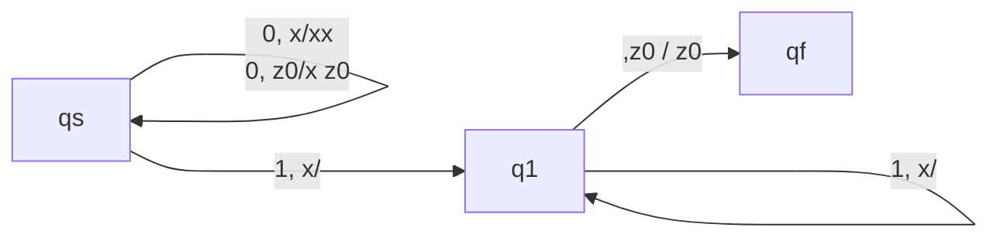
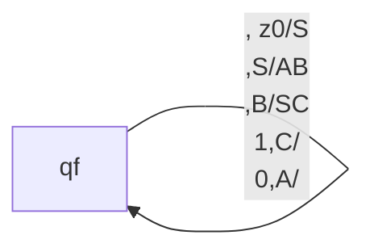

# Push-Down Automaton

Push-Down Automaton (PDA) is an automaton that can test a context-free language. Just like how NFA can test a regular language. PDA is the device we later will use for $LR$ grammar parsing.

## Components of PDA

PDA is an e-NFA with an extra stack. To formulate it more precisely, it contains,

- State set $\mathcal{Q} = \{qs, q_1, q_2, \cdots, q_n\}$
- A vocabulary set $\mathcal{V}$
- A stack vocabulary set $\mathcal{S}$
- A start state $\{ qs \}$
- A stack start character $z_0 \in \mathcal{S}$
- A transition table $\mathcal{T}(q, v, z) = \{(q'_i, Z'_i), \ldots\}, Z'_i \in \mathcal{S}^*$

The $\mathcal{T}$ takes a state, an input vocabulary, and an stack symbol, and gives out a set of possible transitions, including he next state and a stack sentence. PDA will pop the top element, based on the transition table, the input and the current state, transit to a possible state and push every new element into the new stack elements.

We use the empty-stack acceptance. That is, when the stack becomes empty, we accept the input. Some other books may use accept state set like we did in NFA. They have the same level of expressiveness.

The graph to describe PDA is similar to that of e-NFA, just that on each edge, besides the input character, we also note $z/Z'$ as the top element and the sentence to push after transition.

For example, we know that $0^n1^n$ is not a regular language, but we can build a PDA that accepts it.

The $x$ in the stack acts as count for number zero.

This is equivalent to the CFG,

$$
S \rightarrow 0X1 \\
X \rightarrow 0X1 | 01 | \lambda
$$

## Instant Description

For convenience, we use instant description sometimes instead of writing, $\mathcal{T}$.

For FA, we use,

$$
(q, aX) \vdash (q', X')
$$

To represent,

$$
\mathcal{T}(q, aX) = \mathcal{T}(q', X)
$$

For,

$$
q' \in \mathcal{T}(q, a)
$$

Or for DFA,

$$
q' = \mathcal{T}(q, a)
$$

Where $a$ is a terminal symbol, $X$ is the sentence to test.

For PDA, we use,

$$
(q, aX, Z) \vdash (q', X', Z')
$$

Where $Z$ represents the elements in the stack. The left side is the stack top, the right side is the stack bottom.

Again, consider this PDA,

Instead of drawing graphs like we used to, we can use the following instant description. Assume we want it to test $0011$.

$$
(q_s, 0011, z_0) \\
\vdash (q_s, 011, xz_0) \\
\vdash (q_s, 11, xxz_0) \\
\vdash (q_1, 1, xz_0) \\
\vdash (q_1, 1, z_0) \\
\vdash (q_f, \lambda, z_0)
$$

## CFL is the Language of PDA

Consider a CNF CFG, that every CFG can be converted into. Every grammar should be either,

$$
A \rightarrow BC \\
D \rightarrow d
$$

First we define,

$$
\mathcal{T}(q_s, \lambda, z_0) = \{(q_f, S)\}
$$

Then, for each rule like,

$$
A \rightarrow B_0C_0 | B_iC_i
$$

Convert this into,

$$
\mathcal{T}(q_1, \lambda, A) = \{(q_f, B_0C_0), (q_f, B_iC_i)\}
$$

And lastly, for,

$$
D \rightarrow d
$$

We add,

$$
\mathcal{T}(q_f, d, D) = \{(q_f, \lambda)\}
$$

So that, from the start state, the PDA can perform arbitrary operation based on the rules (using leftmost derivation since stack is last in first out). Then, the PDA pops every symbol from the stack, and convert them to the corresponding, terminals- and during the step, consuming all the string.

Let's consider this rule,

$$
S \rightarrow 0X1 \\
X \rightarrow 0X1 | 01 | \lambda
$$

We can convert it into CNF. Firstly, the above grammar equlas,

$$
S \rightarrow 0S1 | \lambda \\
$$

We can convert into CNF with the following steps

$$
S \rightarrow AS1 | \lambda \\
A \rightarrow 0
$$

$$
S \rightarrow AB | \lambda \\
A \rightarrow 0 \\
B \rightarrow S1
$$

$$
S \rightarrow AB | \lambda \\
B \rightarrow SC \\
C \rightarrow 1 \\
A \rightarrow 0 \\
$$

It's safe to ignore the empty generation, $S \rightarrow \lambda$, since it only adds empty sentence to the language, thus, the CNF of the original CFG is,

$$
S \rightarrow AB \\
B \rightarrow SC \\
C \rightarrow 1 \\
A \rightarrow 0 \\
$$

Now we can construct the $\mathcal{T}$.

We first have,

$$
\mathcal{T}(q_f, \lambda, S) = \{(q_f, S)\}
$$

And for the two rules,

$$
S \rightarrow AB \\
B \rightarrow SC \\
$$

We have,

$$
\mathcal{T}(q_f, \lambda, S) = \{(q_f, AB)\} \\
\mathcal{T}(q_f, \lambda, B) = \{(q_f, SC)\}
$$

For,

$$
C \rightarrow 1 \\
A \rightarrow 0 \\
$$

We have,

$$
\mathcal{T}(q_f, 1, C) = \{(q_f, \lambda)\} \\
\mathcal{T}(q_f, 0, A) = \{(q_f, \lambda)\}
$$

We can draw this PDA,

For example, to test $0011$, we have the process,

$$
(q_f,0011,z_0) \\
\vdash (q_f, 0011, S) \\
\vdash (q_f, 0011, AB) \\
\vdash (q_f, 011, B) \\
\vdash (q_f, 011, SC) \\
\vdash (q_f, 011, BCC) \\
\vdash (q_f, 11, CC) \\
\vdash (q_f, 1, C) \\
\vdash (q_f, \lambda, \lambda)
$$

:::tip

We don't actually have to go through the whole CNF process. We can convert the CFG into,

$$
A \rightarrow W^* \\
B \rightarrow b
$$

Where $W^*$ is a string of non-terminals. This conversion is obviously valid.

Then, we define,

$$
\mathcal{T}(q_s, \lambda, A) = \{(q_s, W^*)\} \\
\mathcal{T}(q_s, b, B) = \{(q_s, \lambda)\}
$$

:::

## PDA tests CFL

To convert PDA into CFG, we construct variables look likes this,

$$
A = [qAp]
$$

This is a non-terminal. This variable refers to an edge in the PDA, that state $q$ with stack top $A$ can reach $p$ with an empty stack.

I'll continue by showing how to convert a PDA to a CFG, using simple notations.

## Converting PDA to CFG

For a PDA, we can construct variables in our CFG of the form:

$$[q_i A q_j]$$

Where this variable represents "starting in state $q_i$ with $A$ on top of stack, we can reach state $q_j$ with empty stack.

The key idea is that we can construct grammar rules based on PDA transitions-

If a transition is in form of,

$$
(q', Z') \in \mathcal{T}(q, a, Z)
$$

That is, when a transition $(q', Z_1 Z_2 \dots Z_k) \in \mathcal{T}(q, a, Z)$ exists (where $Z' = Z_1 Z_2 \dots Z_k$ is the sequence pushed onto the stack), we generate **productions** in the CFG to model the effect of this transition on the stack and states. Specifically:

1. **For transitions pushing $k \geq 1$ symbols**:  
   For every possible sequence of intermediate states $q_1, q_2, \dots, q_{k-1}$, add the rule:  
   $$[q Z q''] \rightarrow a \, [q' Z_1 q_1] [q_1 Z_2 q_2] \cdots [q_{k-1} Z_k q'']$$  
   Here, $a$ is the input symbol consumed (or omitted if the transition is on $\varepsilon$). This rule encodes that after popping $Z$ and pushing $Z_1 Z_2 \dots Z_k$, the PDA processes each $Z_i$ sequentially, transitioning through states $q_1, \dots, q_{k-1}$ until the stack empties at $q''$.

2. **For transitions pushing nothing ($k=0$)**:  
   Add the production:  
   $$[q Z q'] \rightarrow a$$  
   This directly represents popping $Z$ and moving to $q'$ while consuming $a$, leaving the stack empty.

3. **Start symbol**:  
   The CFG’s start symbol $S$ derives all variables corresponding to the PDA’s initial configuration:  
   $$S \rightarrow [q_0 Z_0 q] \quad \text{for all } q \in Q,$$  
   where $q_0$ is the PDA’s initial state and $Z_0$ is the initial stack symbol. This ensures all valid computations starting from $q_0$ with $Z_0$ are captured. The $q$ here is the possible state that the PDA is in when the stack is empty. If there exists multiple such states, use a symbol to generate all of them at first.

For example, considering our first PDA,

We have,

$$
\mathcal{T}(q_s, 0, x) = \{(q_s, xx)\} \\
\mathcal{T}(q_s, 0, z_0) = \{(q_s, xz_0)\} \\
\mathcal{T}(q_s, 1, x) = \{(q_1, \lambda)\} \\
\mathcal{T}(q_1, 1, x) = \{(q_1, \lambda)\} \\
\mathcal{T}(q_1, z_0, z_0) = \{(q_f, \lambda)\}
$$

We should construct the grammar with the following step,

The start variable is,

$$
[q_sz_0q_f]
$$

This represents computations starting in  $q_s$ with $z_0$ on the stack and ending in $q_f$ with an empty stack.

We derive productions from each PDA transition:

#### **(a) Transition $(q_s, 0, x) \rightarrow (q_s, xx)$** 

Pushes two $x$ symbols. For all states $q_1, q'' \in \{q_s, q_1, q_f\}$:  

$$
[q_s x q''] \rightarrow 0 \, [q_s x q_1] [q_1 x q'']
$$  

This encodes that after reading `0`, the first $x$ is processed from $q_s \rightarrow q_1$, and the second $x$ from $q_1 \rightarrow q''$.

#### **(b) Transition $(q_s, 0, z_0) \rightarrow (q_s, x z_0)$**  
Pushes $x$ followed by $z_0$. For all $q_1, q'' \in \{q_s, q_1, q_f\}$:  

$$
[q_s z_0 q''] \rightarrow 0 \, [q_s x q_1] [q_1 z_0 q'']
$$  
This encodes processing $x$ from $q_s \rightarrow q_1$, then $z_0$ from $q_1 \rightarrow q''$.

#### **(c) Transition $(q_s, 1, x) \rightarrow (q_1, \lambda)$**  
Pops $x$. Directly generates $1$:  
$$
[q_s x q_1] \rightarrow 1
$$

#### **(d) Transition $(q_1, 1, x) \rightarrow (q_1, \lambda)$**  
Pops $x$. Directly generates $1$:  
$$
[q_1 x q_1] \rightarrow 1
$$

#### **(e) Transition $(q_1, \epsilon, z_0) \rightarrow (q_f, \lambda)$**  
Pops $z_0$ without consuming input. Generates $\lambda$:  

$$
[q_1 z_0 q_f] \rightarrow \lambda
$$

For the string $0 0 1 1$:  

1. Start with $S \rightarrow [q_s z_0 q_f]$.  
2. Use production (b):  
   $$[q_s z_0 q_f] \rightarrow 0 \, [q_s x q_1] [q_1 z_0 q_f].$$  
3. Expand $[q_s x q_1]$ using production (a):  
   $$[q_s x q_1] \rightarrow 0 \, [q_s x q_1] [q_1 x q_1].$$  
4. Apply $[q_s x q_1] \rightarrow 1$ (production c) and $[q_1 x q_1] \rightarrow 1$ (production d):  
   $$011$$  
5. Combine with $[q_1 z_0 q_f] \rightarrow \lambda$:  
   $$0011$$  

The complete CFG is:  

$$
\begin{align*}
S &\rightarrow [q_s z_0 q_f] \\
[q_s x q''] &\rightarrow 0 \, [q_s x q_1] [q_1 x q''] \quad \forall q_1, q'' \in \{q_s, q_1, q_f\} \\
[q_s z_0 q''] &\rightarrow 0 \, [q_s x q_1] [q_1 z_0 q''] \quad \forall q_1, q'' \in \{q_s, q_1, q_f\} \\
[q_s x q_1] &\rightarrow 1 \\
[q_1 x q_1] &\rightarrow 1 \\
[q_1 z_0 q_f] &\rightarrow \lambda \\
\end{align*}
$$
