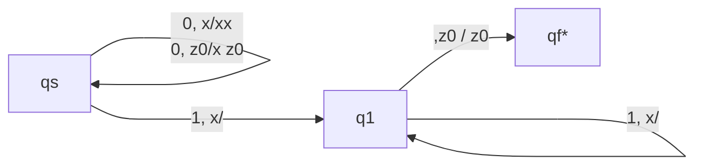
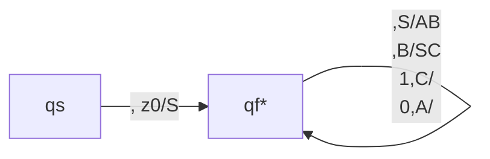

# Push-Down Automaton

Push-Down Automaton (PDA) is an automaton that can test a context-free language. Just like how NFA can test a regular language. PDA is the device we later will use for $LR$ grammar parsing.

## Components of PDA

PDA is an e-NFA with an extra stack. To formulate it more precisely, it contains,

- State set $\mathcal{Q} = \{qs, q_1, q_2, \cdots, q_n\}$
- A vocabulary set $\mathcal{V}$
- A stack vocabulary set $\mathcal{S}$
- An accept state set $\mathcal{F} = \{q_f, q_{f1}, q_{f2}, \cdots, q_{fn}\}$
- A start state $\{ qs \}$
- A stack start character $z_0 \in \mathcal{S}$
- A transition table $\mathcal{T}(q, v, z) = \{(q'_i, Z'_i), \ldots\}, Z'_i \in \mathcal{S}^*$

The $\mathcal{T}$ takes a state, an input vocabulary, and an stack symbol, and gives out a set of possible transitions, including he next state and a stack sentence. PDA will pop the top element, based on the transition table, the input and the current state, transit to a possible state and push every new element into the new stack elements.

The graph to describe PDA is similar to that of e-NFA, just that on each edge, besides the input character, we also note $z/Z'$ as the top element and the sentence to push after transition.

For example, we know that $0^n1^n$ is not a regular language, but we can build a PDA that accepts it.

The $x$ in the stack acts as count for number zero.

This is equivalent to the CFG,

$$
S \rightarrow 0X1 \\
X \rightarrow 0X1 | 01 | \lambda
$$

## Instant Description

For convenience, we use instant description sometimes instead of writing, $\mathcal{T}$.

For FA, we use,

$$
(q, aX) \vdash (q', X')
$$

To represent,

$$
\mathcal{T}(q, aX) = \mathcal{T}(q', X)
$$

For,

$$
q' \in \mathcal{T}(q, a)
$$

Or for DFA,

$$
q' = \mathcal{T}(q, a)
$$

Where $a$ is a terminal symbol, $X$ is the sentence to test.

For PDA, we use,

$$
(q, aX, Z) \vdash (q', X', Z')
$$

Where $Z$ represents the elements in the stack. The left side is the stack top, the right side is the stack bottom.

Again, consider this PDA,

Instead of drawing graphs like we used to, we can use the following instant description. Assume we want it to test $0011$.

$$
(q_s, 0011, z_0) \\
\vdash (q_s, 011, xz_0) \\
\vdash (q_s, 11, xxz_0) \\
\vdash (q_1, 1, xz_0) \\
\vdash (q_1, 1, z_0) \\
\vdash (q_f, \lambda, z_0)
$$

## CFL is the Language of PDA

Consider a CNF CFG, that every CFG can be converted into. Every grammar should be either,

$$
A \rightarrow BC \\
D \rightarrow d
$$

First we define,

$$
\mathcal{T}(q_s, \lambda, z_0) = \{(q_f, S)\}
$$

Then, for each rule like,

$$
A \rightarrow B_0C_0 | B_iC_i
$$

Convert this into,

$$
\mathcal{T}(q_1, \lambda, A) = \{(q_f, B_0C_0), (q_f, B_iC_i)\}
$$

And lastly, for,

$$
D \rightarrow d
$$

We add,

$$
\mathcal{T}(q_f, d, D) = \{(q_f, \lambda)\}
$$

So that, from the start state, the PDA can perform arbitrary operation based on the rules (using leftmost derivation since stack is last in first out). Then, the PDA pops every symbol from the stack, and convert them to the corresponding, terminals- and during the step, consuming all the string.

Let's consider this rule,

$$
S \rightarrow 0X1 \\
X \rightarrow 0X1 | 01 | \lambda
$$

We can convert it into CNF. Firstly, the above grammar equlas,

$$
S \rightarrow 0S1 | \lambda \\
$$

We can convert into CNF with the following steps

$$
S \rightarrow AS1 | \lambda \\
A \rightarrow 0
$$

$$
S \rightarrow AB | \lambda \\
A \rightarrow 0 \\
B \rightarrow S1
$$

$$
S \rightarrow AB | \lambda \\
B \rightarrow SC \\
C \rightarrow 1 \\
A \rightarrow 0 \\
$$

It's safe to ignore the empty generation, $S \rightarrow \lambda$, since it only adds empty sentence to the language, thus, the CNF of the original CFG is,

$$
S \rightarrow AB \\
B \rightarrow SC \\
C \rightarrow 1 \\
A \rightarrow 0 \\
$$

Now we can construct the $\mathcal{T}$.

We first have,

$$
\mathcal{T}(q_s, \lambda, S) = \{(q_f, S)\}
$$

And for the two rules,

$$
S \rightarrow AB \\
B \rightarrow SC \\
$$

We have,

$$
\mathcal{T}(q_f, \lambda, S) = \{(q_f, AB)\} \\
\mathcal{T}(q_f, \lambda, B) = \{(q_f, SC)\}
$$

For,

$$
C \rightarrow 1 \\
A \rightarrow 0 \\
$$

We have,

$$
\mathcal{T}(q_f, 1, C) = \{(q_f, \lambda)\} \\
\mathcal{T}(q_f, 0, A) = \{(q_f, \lambda)\}
$$

We can draw this PDA,

For example, to test $0011$, we have the process,

$$
(q_s,0011,z_0) \\
\vdash (q_f, 0011, S) \\
\vdash (q_f, 0011, AB) \\
\vdash (q_f, 011, B) \\
\vdash (q_f, 011, SC) \\
\vdash (q_f, 011, BCC) \\
\vdash (q_f, 11, CC) \\
\vdash (q_f, 1, C) \\
\vdash (q_f, \lambda, \lambda)
$$

:::tip

We don't actually have to go throw the whole CNF process. We can convert the CFG into,

$$
A \rightarrow W^* \\
B \rightarrow b
$$

Where $W^*$ is a string of non-terminals. This conversion is obviously valid.

Then, we define,

$$
\mathcal{T}(q_s, \lambda, \lambda) = \{(q_f, \lambda)\}
$$

$$
\mathcal{T}(q_f, \lambda, A) = \{(q_f, W^*)\} \\
\mathcal{T}(q_f, b, B) = \{(q_f, \lambda)\}
$$

:::

## PDA tests CFL

