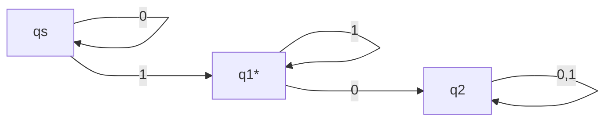
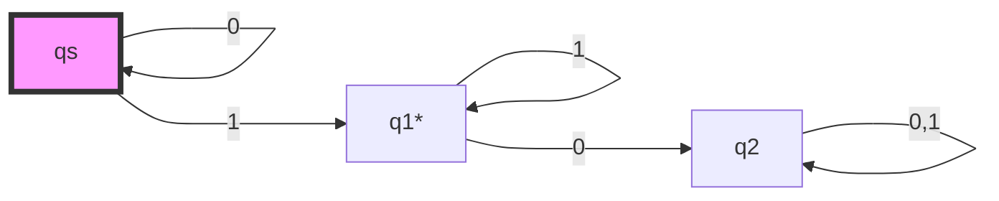
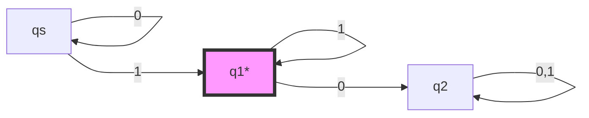
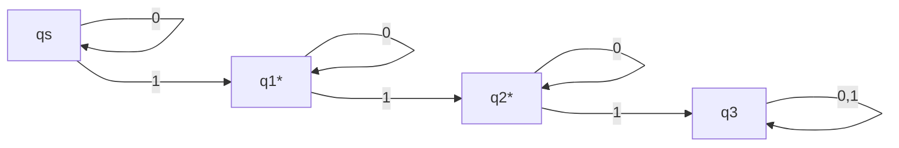
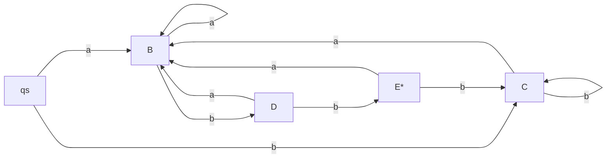
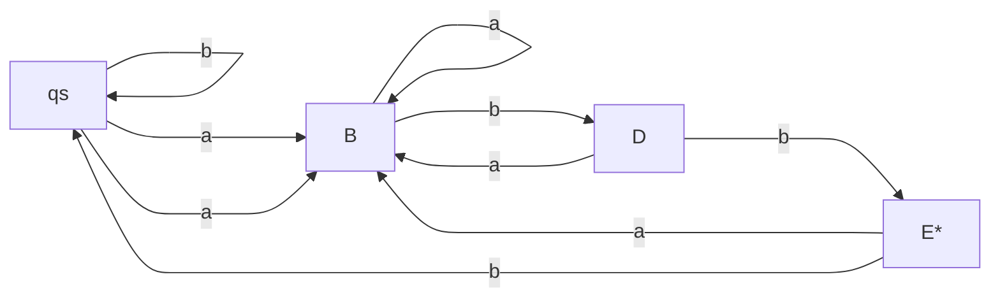

# Deterministic Finite Automaton

Deterministic Finite Automa (DFA) is a machine that can recognize a regular language based on its grammar.

## Components of DFA

### Components

DFA has the following components,

- State set $\mathcal{Q} = \{qs, q_1, q_2, \cdots, q_n\}$
- A vocabulary set $\mathcal{V}$
- A transition table $\mathcal{T}(q, v) = q'$
- A start state $qs$
- An accept state set $\mathcal{F} = \{q_f, q_{f1}, q_{f2}, \cdots, q_{fn}\}$

An automa can take a symbol and transit to another state based on the transition function. That is, if $w=aw'$, then we define,

$$
\mathcal{T}(q, w) = \mathcal{T}(\mathcal{T}(q, a), w')
$$

We also define,

$$
\mathcal{T}(q, \lambda) = q
$$

If a sentence $w$ satisfies,

$$
\mathcal{T}(qs, w) \in \mathcal{F}
$$

Then we say that $w$ is accepted or recognized by the automa.

We often illustrate with a graph, where each node represents a state, and an edge represents a transition, the label of the edge is the symbol that triggers the transition.

For example,

We add a $*$ to denote that the state is an accept state.

If we want this automa to test $001$, we would have the following process (the highted node is the current state), here is the example,

### Example by Graph

#### Step 1: Start at q0

The automaton begins in the start state q0, and the first symbol of the string is 0.

#### Step 2: Still in q0, next symbol is 0

The automaton is still in q0, and it reads another 0, so it remains in q0.

#### Step 3: Now in q0, next symbol is 1

The automaton now reads 1, so it transitions from q0 to q1 (accept state).

#### Final Step: End of input string, and state q1 is accepting

The DFA has finished reading all input symbols (001), and it has ended in q1, which is an accept state. Therefore, the string is accepted.

### Example by Table

We can also just look after the table. Based on the same automa, we have,

|  | 0 | 1 |
| --- | --- | --- |
| qs | qs | q1 |
| q1* | q2 | q1 |
| q2 | q2 | q2 |

Each element in the table is $\mathcal{T}(row, col)$.

If we test $001$,

- Start at qs
- Read 0, go to qs
- Read 0, go to qs
- Read 1, go to q1
- String exhausted, and q1 is an accept state, so the string passes.

## Minimizing a DFA

Sometimes, we may design a DFA that has more states than necessary, for example,

This automa has the exact same function as the automa above. For such simple cases, we can tell by eye. However, for more complex cases, we need a tool to minimize the automa.

We define a pair of states is an equivalent pair if and only if they satisfy all the following conditions,

- They are both accept states or both not accept states.
- When accepting any symbol, they will transit to a pair of equivalent states.

If two states are equivalent, they can be merged into one.

We always use the most optimistic choice with circular decency. That is, if whether $A$ and $B$ are equivalent depends on wether $C$ and $D$ are equivalent, while $C$ and $D$ are dependent on $A$ and $B$. Then we will always assume both of them are equivalent. This is also true for more circular dependencies.

We usually use a table called the equivalence table for help. We will demonstrate how to do it,

Let's consider,

Let's draw the table,

|  | qs | B | C | D | E* |
| --- | --- | --- | --- | --- | --- |
| qs | | | | | |
| B | | | | | |
| C | | | | | |
| D | | | | | |
| E* | | | | | |

We ignore the half above the diagonal and the diagonal. Because the upper half is the exactly same as the lower half, and a state is always in pair with itself.

If we write $✅$ in the element, then it means that the row and column are equivalent. If we write $❌$ in the element, then it means that the row and column are not equivalent. If we write $FG$ in the element, then it means that if the $FG$ are equivalent, then the row and column are equivalent.

Let's construct the equivalence table. Because $E$ is the only end state, no other state is equivalent to $E$. Therefore, we have,

|  | qs | B | C | D | E* |
| --- | --- | --- | --- | --- | --- |
| qs | | | | | |
| B | | | | | |
| C | | | | | |
| D | | | | | |
| E* | ❌ |❌ |❌ |❌ | |

:::tip

We usually firstly fill as many obvious element as possible so that it makes our life a bit easier.

Then, we choose the ones that leads to the determined pairs (no matter whether they are equivalent or not), so that we can have most of the table filled with $✅$ or $❌$.

Lastly, we iterate through all the remaining pairs.

:::

Now we know $E$ is in no pair with any other state. Therefore, it'd be easier for us to consider the pairs in which an element points to $E$.

For example, $D$ points to $E$ after $b$, but for all other states, they don't go to $E$ after $b$, and thus,

|  | qs | B | C | D | E* |
| --- | --- | --- | --- | --- | --- |
| qs | | | | | |
| B | | | | | |
| C | | | | | |
| D | ❌ |❌ |❌ | | |
| E* | ❌ |❌ |❌ |❌ | |

There are no obvious ones, so let's check the only three pairs remaining.

$qs$ and $B$: after $a$, they both go to $B$. After $b$, $qs$ goes to $C$, and $B$ goes to $D$. But $B$ and $D$ are not equivalent, so $qs$ and $B$ are not equivalent.

$C$ and $qs$: after $b$, they both go to $C$. After $a$, they both go to $B$. Thus, $C$ and $qs$ are equivalent.

$C$ and $B$: after $b$, $C$ goes to $C$ but $B$ goes to $D$. $D$ and $C$ are not equivalent, so $C$ and $B$ are not equivalent.

In all,

|  | qs | B | C | D | E* |
| --- | --- | --- | --- | --- | --- |
| qs | | | | | |
| B | ❌ | | | | |
| C | ✅ |❌ | | | |
| D | ❌ |❌ |❌ | | |
| E* | ❌ |❌ |❌ |❌ | |

We can simply redirect all lines pointing to $C$ to $qs$, then remove the $C$ node. In the transition table, we just replace all $C$ with $qs$.

This is a simple case.

We may have this type of table,

|  | qs | F | G | H |
| --- | --- | --- | --- | --- |
| qs | | | | |
| F* |❌ | | | |
| G* |❌ |FH | | |
| H* |❌ |GH |FG | |

There exists circular dependency. We use the most optimistic choice- as we said above, to get the table,

|  | qs | F | G | H |
| --- | --- | --- | --- | --- |
| qs | | | | |
| F* |❌ | | | |
| G* |❌ |✅ | | |
| H* |❌ |✅ |✅ | |

This algorithm is an application of Hopcroft–Karp algorithm.

## The Grammar of DFA

For a DFA, we can create a regular grammar that is equivalent to the DFA.

Suppose we have state set,

$$
\mathcal{Q} = \{qs, q_1, q_2, \cdots, q_n\}
$$

Then, we can create a regular grammar,

$$
q_i \rightarrow a \mathcal{T}(q_i, a)
$$

If $\mathcal{T}(q_i, a) \in \mathcal{F}$, then,

$$
q_i \rightarrow a
$$

So that using the regular grammar, we can generate the language of a DFA.

Please note that, by this conversion,

$$
A \rightarrow aB
$$

Can only exists one such rule. That is to say, $A \rightarrow aB | aC$ is not allowed. So the grammar of DFA is actually a more restricted version of regular grammar.

NFA is actually directly corresponding to the regular grammar.
