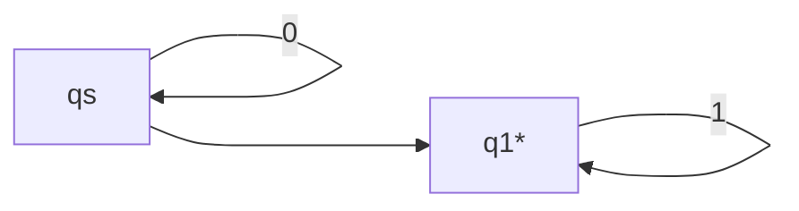
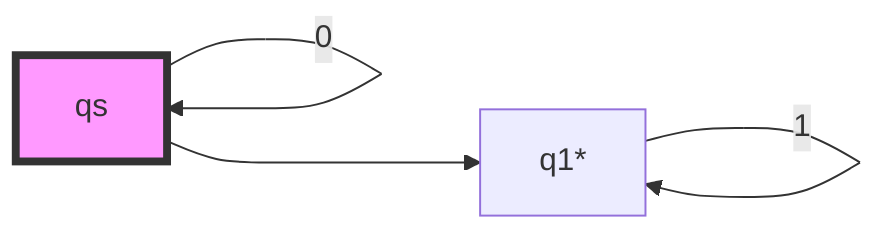
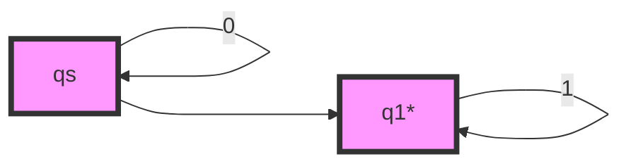
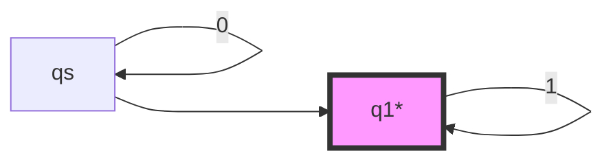
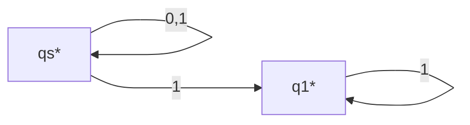

# Non-Deterministic Finite automatonton With Empty Transitions

We have nullable regular languages, and so we have nullable NFA, that is, NFA with empty transitions, also called e-NFA ($\epsilon$-NFA).

## Components of e-NFA

### Components

e-NFA has all its parts the same as NFA. But we allow instead of making,

$$
\hat{\mathcal{T}}(\{q_i\}, \lambda \text{ as empty sentence}) = \{q_i\}
$$

We would allow to accept $\lambda$ as a symbol,

$$
\hat{\mathcal{T}}(\{q_i\}, \lambda \text{ as a sentence with one symbol}) = \{q_j\}
$$

Please note that, when it comes to $\hat{\mathcal{T}}$, it is the NFA that accepts $\lambda$ as a normal symbol instead of the empty sentence. But for e-NFA, we use $\mathcal{T}$ and it treats $\lambda$ an empty sentence.

Because $(\lambda \text{ as empty sentence})^n = \lambda \text{ as empty sentence} \; (n \geq 0)$, thus,

$$
\mathcal{T}(\{q_i\}, v) = \bigcup_{n \geq 0, m \geq 0} \mathcal{T}(\{q_i\}, (\lambda \text{ as empty sentence})^nv(\lambda \text{ as empty sentence})^m) \\
= \bigcup_{n \geq 0, m \geq 0} \hat{\mathcal{T}}(\hat{\mathcal{T}}(\hat{\mathcal{T}}(\{q_i\}, (\lambda \text{ as a symbol})^n),v), (\lambda \text{ as a symbol})^m)
$$

This seems kind of complex. We can define a concept called the $lambda$ closure of a set of states, the $\mathcal{Q_i}^\lambda$,

$$
\mathcal{Q_i}^\lambda = \bigcup_{n \geq 0} \hat{\mathcal{T}}(\mathcal{Q_i}, \lambda^n)
$$

That is to say, the $lambda$ closure of a set of states is the set of states that can be reached by a sequence of empty transitions.

So the e-NFA transition function is,

$$
\mathcal{T}(\mathcal{Q_i}, v) = \hat{\mathcal{T}}(\mathcal{Q_i}^\lambda, v)^\lambda
$$

Much easier to understand.

### Example

For example,

We test $01$ on this.

The edge with no label is an empty transition.

Firstly, we have $qs$,

Now we take in $0$. Before the transition cost, let's find the $lambda$ closure of the current state,

Then we perform the transition,

After the transition of cost, we need to find the $lambda$ closure of the current state as the final result,

So after the transition, the current state is $\{qs, q1\}$.

Now let's take in $1$, obviously, the closure of the current state is still $\{qs, q1\}$.

Then we take in $1$, which results in a state set $\{q1\}$.

We need to find the $\lambda$ closure of the current state as the final result, which is still, $\{q1\}$.

Because in the final state set, $q1$ is an accept state, so the string is accepted.

## Removing the Empty Transitions

e-NFA is more easier to design compared to NFA. And we need a way to convert it to NFA, so that it can be made into a minimized DFA. For the minimized DFA, we can write the most efficient program to recognize the language.

How to remove the empty transitions? Let's consider the transition table of the e-NFA,

|  | 0 | 1 | $\lambda$ |
| --- | --- | --- | --- |
| qs | \{qs\} | $\emptyset$ | \{q1\} |
| q1* | $\emptyset$ | \{q1\} | $\emptyset$ |

It is very simple- for each element in the table, we use it's $\lambda$ closure to replace itself.

The $\lambda$ closure of $\{qs\}$ is $\{qs, q1\}$, of $\{q1\}$ is $\{q1\}$, of $\emptyset$ is $\emptyset$.

Then, because some state can transit to accept state with no cost. In the new NFA, it should be an accept state as well. That is to say, if,

$$
\{q_i\}^\lambda \cap \mathcal{F} \neq \emptyset
$$

Then, $q_i$ is an accept state in the new NFA.

Thus, we can have a NFA transition table,

|  | 0 | 1 |
| --- | --- | --- |
| qs* | \{qs\} | \{qs, q1\} |
| q1* | $\emptyset$ | \{q1\} |

We can draw that as,

## Grammar of e-NFA

We can take a similar rule to convert from e-NFA to its grammar. So in the end, we will have,

$$
A \rightarrow aA \\
A \rightarrow a \\
A \rightarrow B
$$

Where $A \rightarrow B$ is corresponding to the empty transition.

Because all $A \rightarrow B$ can be reduced into,

$$
A \rightarrow aA \\
A \rightarrow a \\
$$

We simply find the generated result of $B$ that is in form of $bB$ or $b$. Then add the new grammar to replace the old one,

$$
A \rightarrow aB \\
A \rightarrow b \\
$$

So that we can get a regular grammar.

Please note that we do not need to consider the case of,

$$
A \rightarrow bB | cC
$$

Because e-NFA allows non-deterministic transitions.

Thus, e-NFA also accepts regular language.
