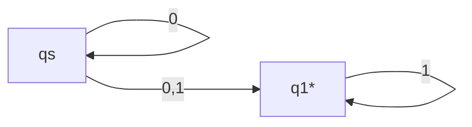
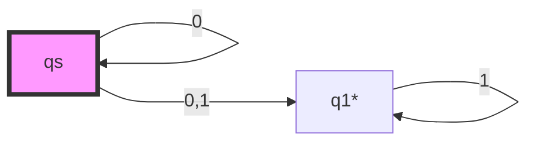
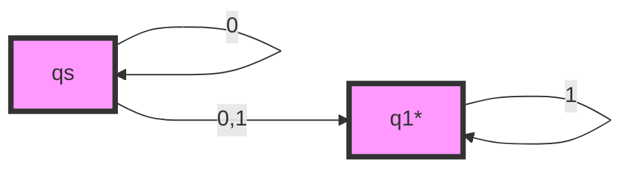
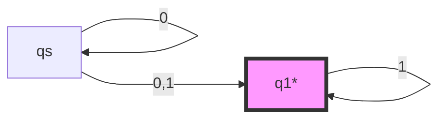
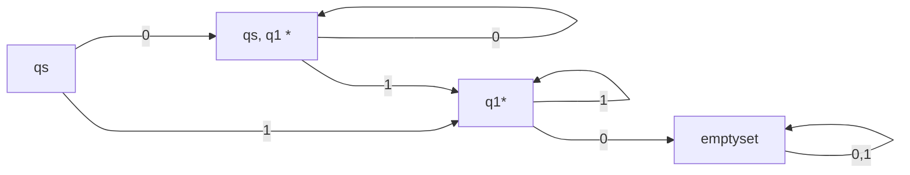

# Non-Deterministic Finite Automaton

Non-Deterministic Finite Automa (NFA) is an extension to the DFA that is simpler to design. It can be converted into a DFA and thus, it also accepts a regular language.

## Components of NFA

### Components

A NFA has the following components,

- State set $\mathcal{Q} = \{qs, q_1, q_2, \cdots, q_n\}$
- A vocabulary set $\mathcal{V}$
- A transition table $\mathcal{T}(q, v)$
- A start state $\{ qs \}$
- An accept state set $\mathcal{F} = \{q_f, q_{f1}, q_{f2}, \cdots, q_{fn}\}$

Unlike DFA, the transition table for NFA yields a set instead of a single state. In addition, the current state of NFA is also a set instead of a single state.

For the transition function, we extend it to take a set of states, that is,

$$
\mathcal{T}(\bigcup_{i\in \mathbb{I}} q_i, v) = \bigcup_{i=\mathbb{I}} \mathcal{T}(q_i, v)
$$

Where $\mathbf{I}$ is any set of indices.

This means that, unlike DFA, NFA has the capacity at staying at multiple states at the same time.

In the end, the accept condition is,

$$
\mathcal{T}(\{q_s\}, v) \cap \mathcal{F} \neq \emptyset
$$

### Example

We consider the following example,

Let's test it on $001$, first do it graphically,

After taking in $0$, both $q0$ and $q1$ are in the current state set,

After taking another $0$, the current state set remains unchanged,

After taking $1$, only $q1$ is in the current state set,

Because there exists a accept state in the final state set, we accept the string.

Let's consider what would happen with $0010$. Obviously, we can continue from before.

Because $q1$ transits to an empty set after taking in $0$, so, now the current state set is $\emptyset$.

As we reached the end of the string, there exists no accept state in the current state set, so we reject the string.

Please note that, when the current state set is empty, no matter how many more words are going in, it will remain empty. This is what we call the dead state. If the prefix of a test string will lead the automa into the dead state, we can early reject it.

## Converting NFA to DFA

Based on the previous example, we can tell that, if we use the subset of $\mathcal{Q}$ as the state of a new automa, we will have the corresponding DFA automatically. However, if we just list all subset one by one, there will be too many states. Although you can minimize that DFA, it's still hard to convert considering the exponential complexity.

So we have a way to iterate through all possible subset of $\mathcal{Q}$, and we call it the Kleene's algorithm.

We do it in the following steps. Still based on the previous example,

We will list the transition table in our new DFA as follows,

|  | 0 | 1 |
| - | - | - |
| \{qs\} | - | - |

Again, the state of DFA is a subset of the state of NFA. The starting state is obviously, $\{qs\}$.

Now we must find all possible subset of $\mathcal{Q}$. We consider the now unfilled cell.

Because, $\mathcal{T}(\{qs\}, 0) = \{q0, q1\}$ and $\mathcal{T}(\{qs\}, 1) = \{q1\}$, we can fill in the table as follows,

|  | 0 | 1 |
| - | - | - |
| \{qs\} | \{qs, q1\} | \{q1\} |
| \{qs, q1\} | - | - |
| \{q1\} | - | - |

Because $\{qs\}$ can transit to $\{qs, q1\}$ or $\{q1\}$, our new DFA must have theses stats as well. So we append $\{qs, q1\}$ and $\{q1\}$ to the state set of DFA.

Then, we repeat this process until there is no more appending.

For $\{qs, q1\}$, if it receives $0$, it transit to itself. If it receives $1$, it transits to $\{q1\}$.

For $\{q1\}$, if it receives $0$, it transit to $\emptyset$. If it receives $1$, it transits to itself.

Now we have,

|  | 0 | 1 |
| - | - | - |
| \{qs\} | \{qs, q1\} | \{q1\} |
| \{qs, q1\} | \{qs, q1\} | \{q1\} |
| \{q1\} | $\emptyset$ | \{q1\} |
| $\emptyset$ | - | - |

Obviously, $\emptyset$ transits to itself no matter what it receives. So,

|  | 0 | 1 |
| - | - | - |
| \{qs\} | \{qs, q1\} | \{q1\} |
| \{qs, q1\} | \{qs, q1\} | \{q1\} |
| \{q1\} | $\emptyset$ | \{q1\} |
| $\emptyset$ | $\emptyset$ | $\emptyset$ |

Now, there are no unfilled cells nor new rows. Thus, this is the transition table for DFA.

Then we mark the accept state of the DFA- it's simple. If a new state set in DFA contains an accept state in NFA, it's an accept state in DFA.

Thus,

|  | 0 | 1 |
| - | - | - |
| \{qs\} | \{qs, q1\} | \{q1\} |
| \{qs, q1\}* | \{qs, q1\} | \{q1\} |
| \{q1\}* | $\emptyset$ | \{q1\} |
| $\emptyset$ | $\emptyset$ | $\emptyset$ |

The state of the new DFA is, $\{ \{qs\}, \{qs, q1\}, \{q1\}, \emptyset \}$, and the accept state is, $\{ \{qs, q1\}, \{q1\} \}$.

We can draw the automaton as follows,

## The Grammar of NFA

### NFA Grammar is Regular Grammar

With the same method as the DFA, we can have the following rules.

$$
A \rightarrow aB \\
A \rightarrow a
$$

This is exactly the regular grammar. The grammar of NFA is the regular grammar, the regular grammar is the grammar of NFA. And unlike DFA that poses extra constraints, NFA does not pose any constraints. The grammar of NFA is the regular grammar.

### From Regular Grammar to NFA

For a regular grammer, it takes either of the forms,

$$
A \rightarrow aB
$$

Or,

$$
A \rightarrow a
$$

If it is the first case, then we create two states $A$ and $B$ if there doesn't exist one. Then adding an edge with label $a$ from $A$ to $B$.

If it's the second case, we create a state $A$ and an accept state $qa$ if there doesn't exist one. Then we add an edge from $A$ to $qa$ with label $a$.

By constructing the automa, we can test all strings in the given regular language.

This is because, for any sentence $v$ generated by the regular grammar.

$$
S \Rightarrow^* v
$$

Let's break it into,

$$
S \Rightarrow v_1 \Rightarrow v_2 \ldots \Rightarrow v
$$

Then for each intermediate sentence $v_i$,

$$
\mathcal{T}(qs, 0@v) = q_1
$$

Then,

$$
\mathcal{T}(q_i, i@v) = q_{i + 1}
$$

So there exists a one to one map from,

$$
\mathcal{T}(q_i, i@v) = q_{i + 1}
$$

To,

$$
v_i \Rightarrow v_{i + 1}
$$

Thus, derivation is state transition. And thus, we can prove that all regular languages can be represented by NFA.

And because NFA cna be converted to a DFA, we can prove that all regular languages can be represented by DFA.
