# Regular Expression

Regular expression is a simpler way to describe a regular language.

## Regular Expression

### Definition

Regular expression is an expression that can yield a language (later proved to be a regular language). We note $\mathcal{L}(\cdot)$ as the language generated by the regular expression $\cdot$.

Regular expression is defined as,

Any sentence $v$ is a valid regular expression, $\mathcal{L}(v) = \{ v \}$.

The $*$ of a regular expression $r$ is still a regular expression, $\mathcal{L}(r^*) = \mathcal{L}(r)^*$

The $+$ of a regular expression $r$ is still a regular expression, $\mathcal{L}(r^+) = \mathcal{L}(r)^+$

If $r$ is a regular expression, $r^n$ is also a regular expression, $\mathcal{L}(r^n) = \mathcal{L}(r)^n$

If $r_1$ and $r_2$ are regular expressions, then $r_1 r_2$ is also a regular expression, $\mathcal{L}(r_1r_2) = \mathcal{L}(r_1)\mathcal{L}(r_2)$.

If $r_1$ and $r_2$ are regular expressions, then $r_1 + r_2$ is also a regular expression, $\mathcal{L}(r_1 + r_2) = \mathcal{L}(r_1) \cup \mathcal{L}(r_2)$

### Example

For example, the regular expression,

$$
(0+1)^*1(0+1)^*
$$

Yields the language,

$$
\{s | s \in \{0,1\}^* \land s \text{ contains the symbol 1}\}
$$

The expression

$$
0^+(0 + 1)^*
$$

Yields the language,

$$
\{s | s \in \{0,1\}^* \land s \text{ starts with the symbol 0}\}
$$

$$
(0+1)^*1^3(0+1)^*
$$

This regular expression yields the language,

$$
\{s | s \in \{0,1\}^* \land s \text{ contains three consecutive 1s}\}
$$

## Regular Expression can be Represented by e-NFA

We can convert regular expression to e-NFA based on patterns above.

We will firstly simplify the expression by using as little symbols as possible, so that we need to remember fewer patterns.

- We can eliminate $a^n$ with $a\ldots a$ ($n$ consecutive $a$)
- We can eliminate $a^+$ with $aa^*$

Now we only have three patterns,

- $r_1+r_2$
- $r_1r_2$
- $r^*$
- $v$

### Sentence

Obviously, if a regular expression is a sentence $v$, we can convert it to an e-NFA directly, with,

```mermaid
graph LR
  qs ---> q0
  q0 --->|0@v| q1
  q1 --->|...| qi
  qi --->|i@v| qi+1
  qi+1 --->|...| qn-1
  qn-1 --->|n-1@v| qn
  qn ---> qf
```

The $qs$ and $qf$ are the two proximity. Of course, we can remove them to get the same e-NFA, but during the conversion from regular expression to e-NFA, we always keep two nodes with empty transition at the proximity so that later it will be convenient for joining the patterns.

### Star Closure

We note,

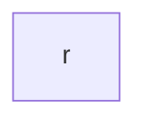

As a sub graph that accepts the language of the regular expression $r$.

And the e-NFA for $r^*$ is,

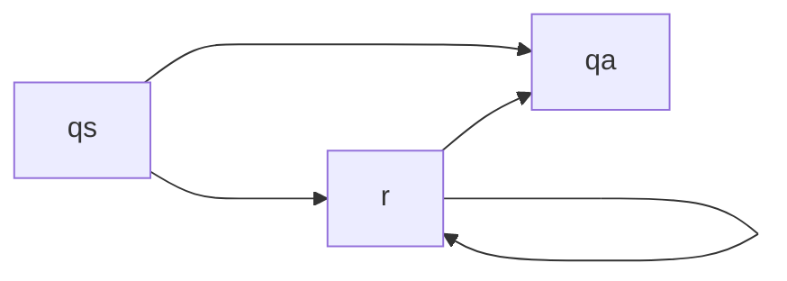

Please note that all transition here are empty transition.

### Concatenation

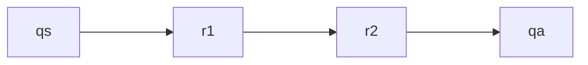

### Union

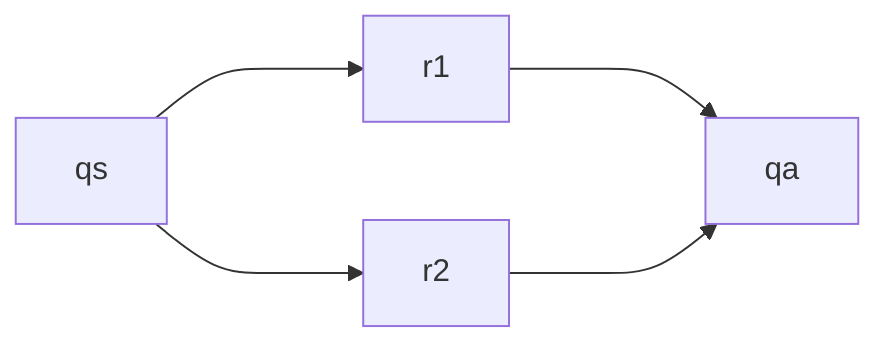
### Example

Let's convert,

$$
r = 0^+(00 + 11)^*
$$

To e-NFA.

We first remove the $+$,

$$
r = 00^*(00 + 11)^*
$$

Then we factor it into,

$$
r = r_0r_1^*(r_2+r_3)^*
$$

Where $r_0 = 0$, $r_1 = 0$, $r_2 = 00$, $r_3 = 11$.

When can convert $r_0$ to,

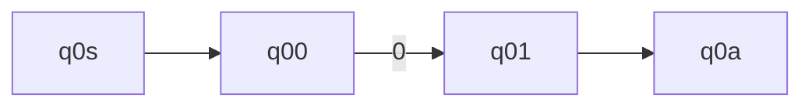

$r_1^*$ to,

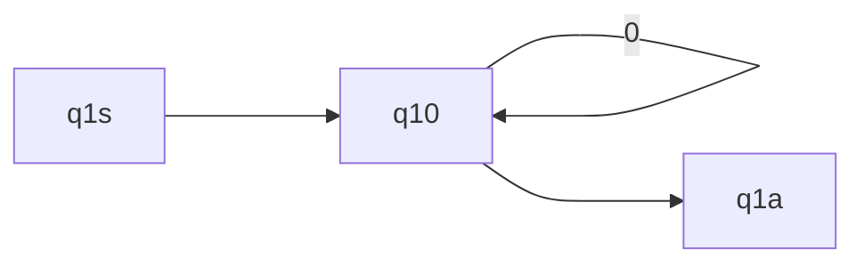

$r_2+r_3$ to,

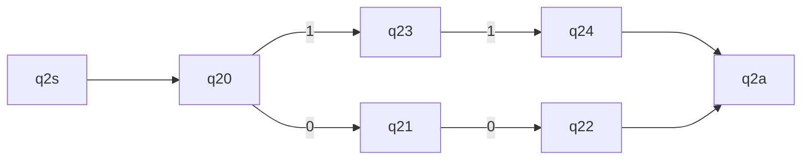

$(r_2+r_3)^*$ to,

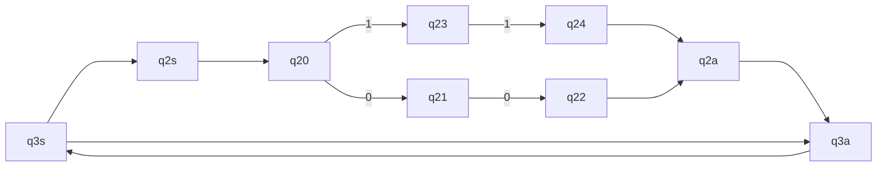

Finally we concatenate them,

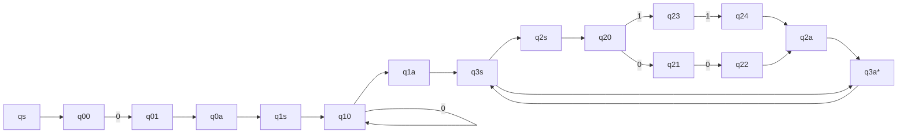

We can remove some obviously redundant nodes,

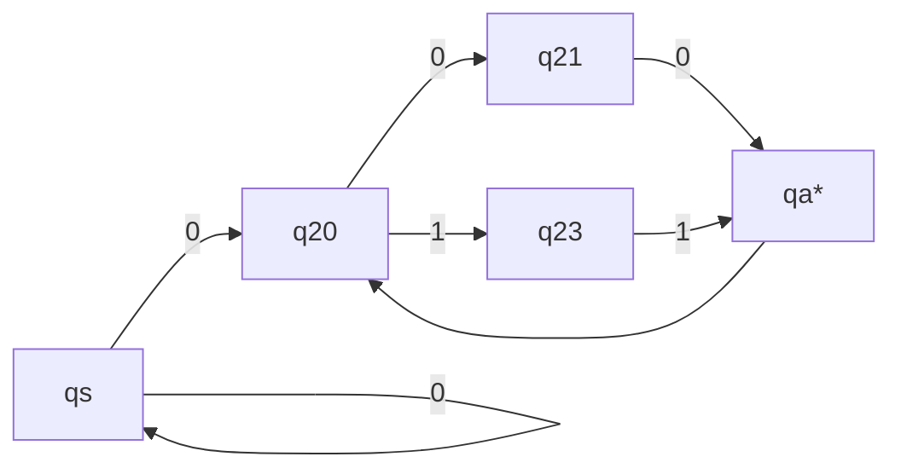

We can further reduce this into NFA, then DFA, minimized DFA.

## e-NFA can Test Regular Expressions

:::tip

DFA and NFA are special e-NFA.

:::

If we get an e-NFA, we can convert it to a regular expression. The method is step-by-step pattern matching.

We note,

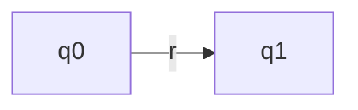

Stands for $\mathcal{T}(\{q_0\}, v) = \{q_1\} \, v \in \mathcal{L}(r)$.

For convenience.

Please note that, during the process, we need to mark all $\mathcal{F}^\lambda$ in each step as accept states.

### Patterns

Typical patterns contains,

#### Concatenation

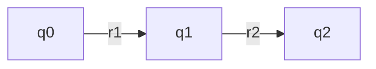

Into,

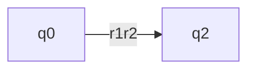

#### Union

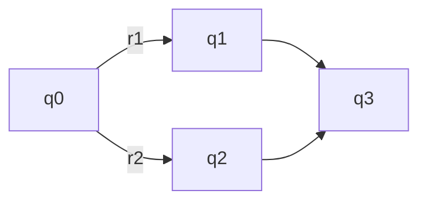

Into,

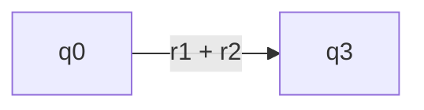

#### Star Closure

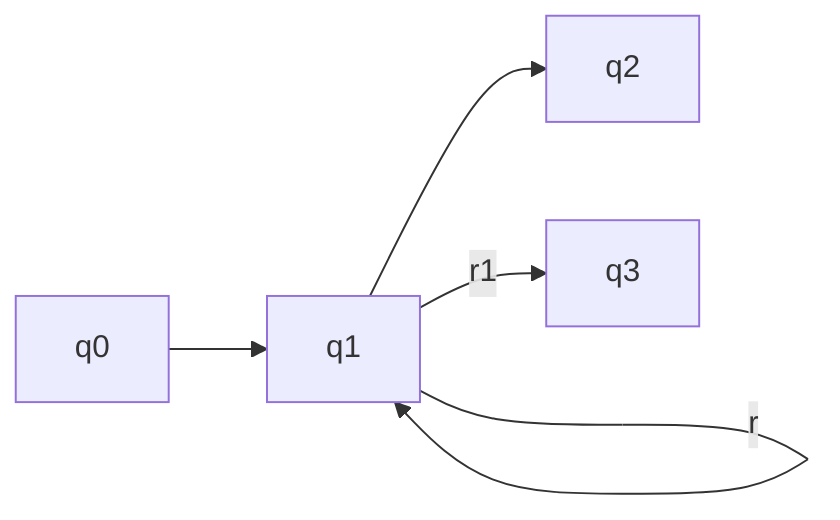

Into,

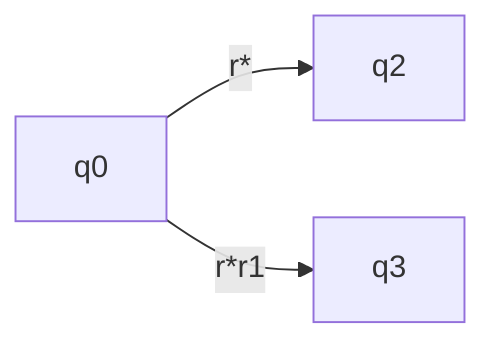

### Example

Let's take a look back at the e-NFA we got in the previous section,


We can merge some obvious patterns,

 ```mermaid
graph LR
  q0s[qs] -->|0| q20
  q20 -->|00| q2a[qa*]
  q20 -->|11| q2a
  q0s -->|0| q0s
  q2a --> q20
```

Two parallel edges matches our previous union pattern, so,

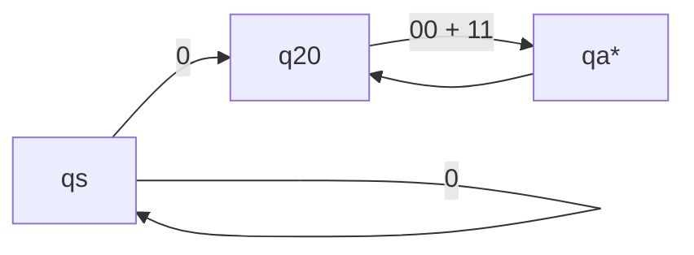

We can remove an empty transition,

```mermaid
graph LR
  q0s[qs] -->|0| q20[q20*]
  q20 -->|"(00 + 11)*"| q20
  q0s --> |0|q0s
```

Then,

```mermaid
graph LR
  q0s[qs] -->|0 * 0| q20[q20*]
  q20 -->|"(00 + 11)*"| q20
```

Finally,

```mermaid
graph LR
  q0s[qs] -->|"0 * 0(00 + 11) * "| q20[q20*]
```

Thus the given e-NFA can be converted into $0^* 0(00 + 11)^*$.

This seems a bit different from $00^*(00+11)^*$, but they generates the same language.
